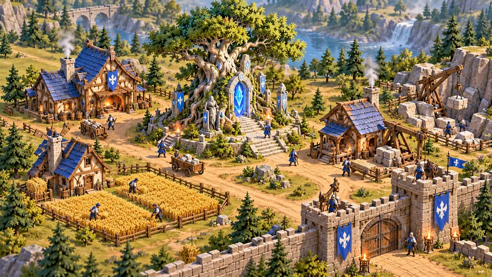
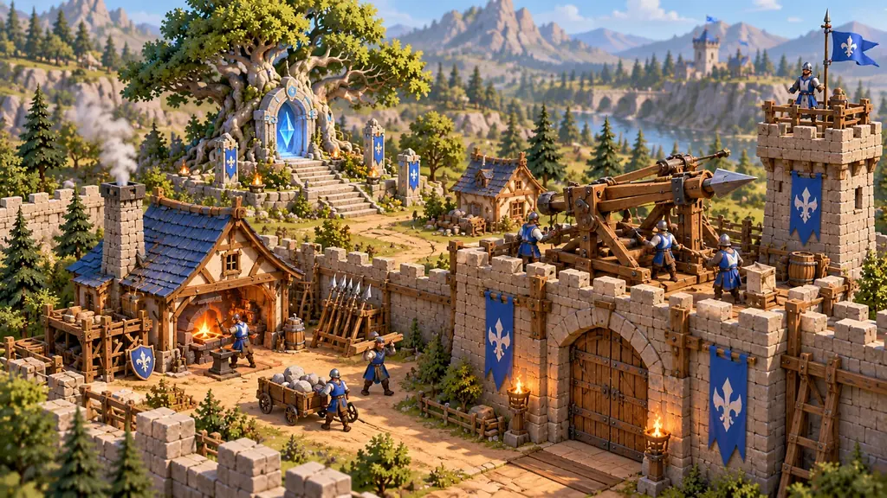
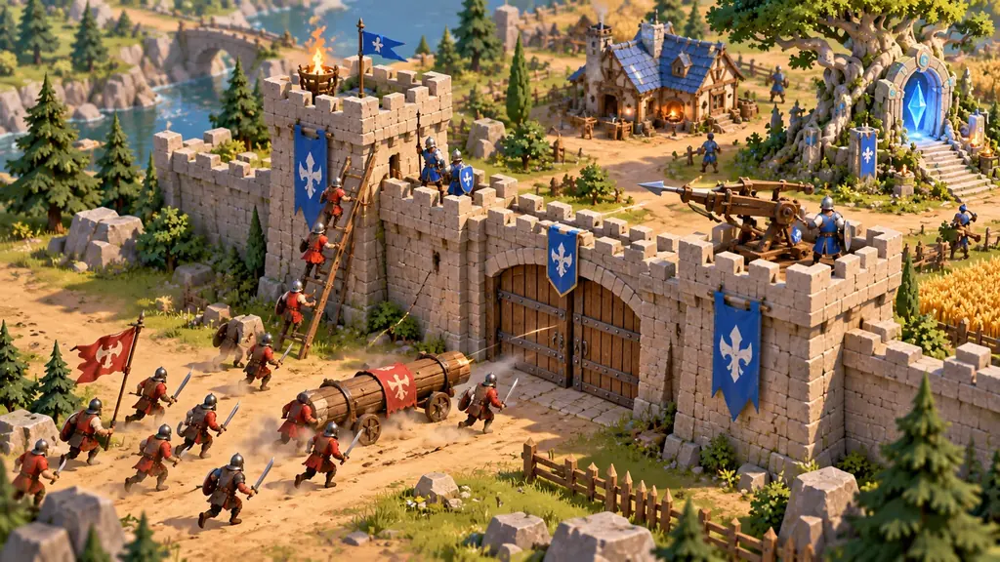
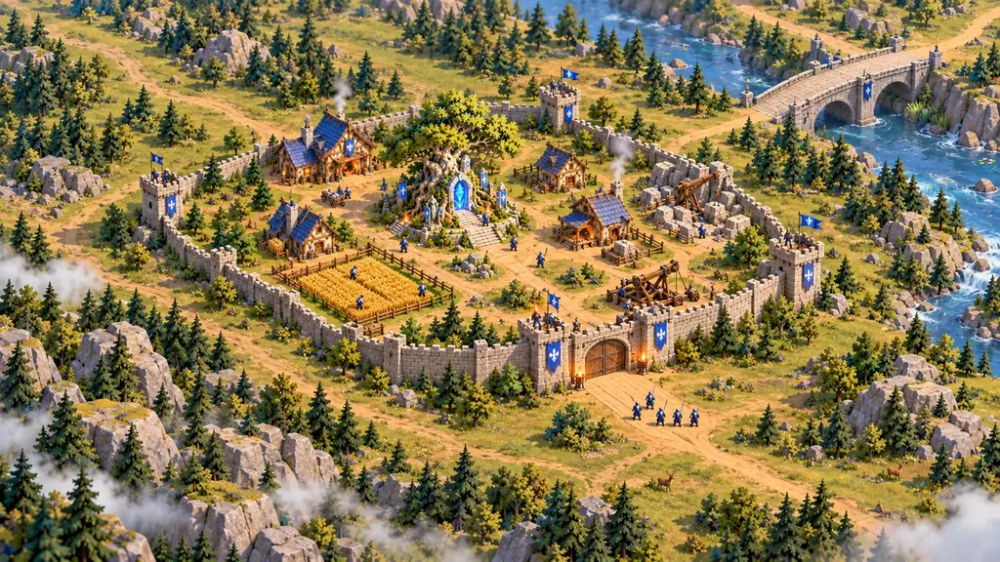

# Art Direction v0.2

Статус: **Согласованное рабочее направление / representative-target input**  
Дата: **2026-10-05**  
Проект: **Web RTS**  
Основание: [Game Vision](./game-vision.md), интерактивный visual brief [#48](https://github.com/Web-Usov/web-rts/issues/48), issue [#49](https://github.com/Web-Usov/web-rts/issues/49), hybrid style decision [#75](https://github.com/Web-Usov/web-rts/issues/75).

Этот документ конкретизирует визуальный раздел Game Vision. Он не переопределяет Game Vision, Technical Vision или ADR. Если возникает конфликт, действует более высокий уровень source of truth.

Concept art ниже — **визуальные reference targets**, а не production assets, не точные layout карты и не обещание конкретного количества объектов в gameplay.

### Связь с gameplay specs

Art Direction описывает **долгосрочный визуальный target проекта**, а не scope конкретного gameplay milestone.

Поэтому наличие на concept art или в этом документе:

- дорог;
- полей;
- ворот;
- домов;
- quarry / рабочих зон;
- кранов и другой инженерии;
- outposts;
- fog / weather;
- большого числа юнитов или декоративных props

**не добавляет эти системы в ближайшую gameplay spec автоматически**.

Конкретная feature/spec определяет, какие gameplay entities и mechanics существуют в данном milestone. Art Direction определяет, **как они должны визуально читаться**, если и когда входят в scope.

Обратное тоже верно: developer/proxy art в раннем vertical slice не считается финальным визуальным решением только потому, что gameplay entity уже реализована.

## 1. Короткая формула

Рабочий shorthand направления:

> **Cozy Frontier × Absurd Siege**

Web RTS должен выглядеть как яркий, уютный, немного кривоватый средневековый мир, в котором маленькая человеческая цивилизация строит красивое поселение, осваивает дикую территорию и защищает её от несоразмерно большой и странной угрозы с помощью стен, армии и слегка нелепой инженерии.

Главный эмоциональный контраст:

> **место, которое хочется сохранить** ↔ **угроза, способная его смести**

Город важен не только как набор gameplay-функций. По мере матча он должен визуально превращаться из небольшого поселения в обжитую территорию, к которой игрок успевает привязаться.

## 2. Основные визуальные столпы

### Readability before detail

Силуэт, цветовое пятно и gameplay-категория должны считываться раньше мелких деталей.

Особенно это важно для:

- зданий;
- стен и ворот;
- типов войск;
- групп армии;
- PvE-массы;
- ресурсов;
- Sacred Site;
- оборонительных машин.

Красивый объект, который превращается в шум на обычном RTS-zoom, считается неудачным.

### Cozy civilization

Человеческая сторона мира должна быть тёплой, рукотворной и немного несовершенной:

- слегка кривые крыши и балки;
- деревянные пристройки;
- дымоходы;
- небольшие мастерские;
- поля;
- дороги;
- ограды;
- телеги;
- склады;
- крупные функциональные props.

Поселение не должно выглядеть стерильно или как идеально симметричный набор модулей.

### Absurd engineering

Люди решают сверхъестественные и масштабные проблемы в основном физическими средствами:

- большие баллисты;
- краны;
- подъёмники;
- лебёдки;
- осадные и оборонительные механизмы;
- массивные деревянно-металлические конструкции.

Инженерия может быть слегка чрезмерной относительно людей, но должна оставаться материальной и понятной, а не превращаться в magitech.

### Strange world

Fantasy сильнее проявляется в окружающем мире, Sacred Site и PvE, чем в обычной человеческой технологии.

Мир может содержать:

- необычно крупные деревья и камни;
- странные природные формы;
- древние сооружения;
- магические явления;
- неизвестных существ;
- туман и атмосферные зоны.

Это всё ещё узнаваемый мир, а не psychedelic alien landscape.

### Lightness without parody

Игра допускает юмор через:

- пропорции;
- инженерные решения;
- небольшие анимационные детали;
- абсурд масштаба происходящего;
- environmental stories.

При этом мир не должен ощущаться пародией. Персонажи относятся к происходящему серьёзно, даже если сама ситуация визуально забавна.

## 3. Visual system

| Ось | Направление |
|---|---|
| Геометрия | **Stylized Low-Poly / Soft Hand-Painted**: production-friendly low-poly geometry, крупные формы, restrained faceting |
| Пропорции | Умеренно карикатурные; люди короткие, крепкие, оружие и важные детали немного увеличены |
| Силуэт | Тип сущности должен считываться с игрового расстояния |
| Материалы | Matte / soft hand-painted feeling; небольшая color/material variation без texture noise и photorealism |
| Детализация | Деталь концентрируется на крупных функциональных элементах, а не на texture noise |
| Палитра | Яркая стилизованная, но с ясной иерархией и достаточным разделением gameplay-объектов |
| Player color | Акценты на ткани, знаменах, щитах, отдельных частях крыш/экипировки; не полный recolor объекта |
| Свет | Тёплый и читаемый базовый свет; атаки, туман и погода могут усиливать контраст |
| Края | Чистые формы; polygon facets могут помогать отдельным объектам, но не являются обязательной художественной целью |
| Анимация | Сдержанная и функциональная; без постоянной cartoon elasticity |
| UI | Современный чистый game UI, визуально отделённый от 3D-мира |

Термин **low-poly** здесь означает прежде всего дисциплину формы, стоимости и читаемости. Visible faceting / flat shading не является обязательным стилевым приёмом.

### Approved production-style target

Зафиксированная точка между ранними painterly concepts и чистым faceted low-poly:

> **Stylized Low-Poly / Soft Hand-Painted**

Практически это означает:

- **geometry / silhouette target** берётся из low-poly подхода: простые meshes, крупные формы, хороший strategic readability;
- **material / mood target** берётся из painterly exploration: тёплые matte surfaces, небольшая variation цвета и материала, ощущение обжитого мира;
- low-poly не должен визуально превращаться в generic asset-pack style только за счёт одинакового visible faceting;
- человеческая архитектура сохраняет небольшую асимметрию, кривоватость и handmade / lived-in feeling;
- micro-detail и texture noise не используются для компенсации слабого силуэта;
- close zoom может раскрывать material cues и крупные бытовые детали, но normal / strategic zoom остаются главным art-budget constraint;
- repeated environment assets должны быть достаточно простыми для browser RTS, но variation формы/масштаба/поворота не должна создавать ощущение стерильного набора одинаковых модулей.

Painterly references поэтому остаются **mood/material targets**, а чистые low-poly iterations — **geometry/readability targets**. Новые hybrid references являются основной визуальной точкой для representative Babylon target G13 (#66).

Синий цвет на текущих concepts — пример одного player-color slot, а не зафиксированная финальная multiplayer palette.

Player-color должен следовать **стабильной gameplay identity / ownership policy**, а не временно меняться только из-за смены command control. Точная связь Owner / Team / Controller определяется gameplay/technical spec; Art Direction фиксирует лишь визуальный принцип: временная потеря или передача control сама по себе не должна случайно перекрашивать принадлежащий игроку объект.

## 4. Люди и армия

Базовая человеческая культура одна. Игроки различаются прежде всего player-color accents, а не отдельными архитектурными цивилизациями.

Обычный человек:

- слегка укороченные пропорции;
- крепкий силуэт;
- относительно крупные руки, шлем, щит или оружие;
- лицо и мелкие элементы не являются главным носителем идентичности;
- роль юнита должна читаться по силуэту и крупным атрибутам.

На дальнем zoom армия должна восприниматься как **читаемые группы**, а не как десятки конкурирующих между собой миниатюрных персонажей.

## 5. Здания и освоение территории

Каждый основной тип здания должен иметь сильный силуэт.

Предпочтительная логика:

- дом читается по общей форме и крыше;
- кузница — по массивному дымоходу / открытому рабочему объёму;
- военное здание — по более жёсткой геометрии и крупному equipment;
- defensive structures — по ясной вертикали и wall language;
- экономические зоны — по крупным resource cues.

База умеренно компактная, но между функциональными зонами должно оставаться достаточно negative space.

Освоение территории должно быть видно:

- появляются дороги;
- земля становится вытоптанной и организованной;
- возникают поля и ограды;
- появляются рабочие зоны;
- укрепления и outposts обозначают расширение присутствия.

Не нужно заполнять каждый свободный метр декоративными props.

## 6. Sacred Site

Текущее визуальное направление Sacred Site объединяет три идеи:

1. **древнее священное дерево**;
2. **каменный храм / монумент**;
3. **магическое или сверхъестественное явление**.

Рабочий образ: огромное древнее дерево срослось с каменной структурой неизвестного происхождения. Корни охватывают ступени, арки и отдельные монолиты; внутри или возле структуры может присутствовать холодное магическое свечение.

Важно сохранить вопрос:

> храм построили вокруг дерева, дерево выросло из монумента или это изначально единый объект?

Происхождение визуально должно оставаться неочевидным.

В hybrid target Sacred Site намеренно менее «собран» и симметричен, чем человеческие здания:

- корни физически деформируют и охватывают каменную структуру;
- монолиты и фрагменты могут стоять под слегка странными углами;
- архитектурная логика не обязана полностью совпадать с human-side construction language;
- холодное свечение остаётся restrained magical cue и не должно превращать объект в чистый sci-fi portal.

Это усиливает контраст: **human side понятна и рукотворна; Sacred Site древний, странный и не до конца объяснимый**.

Sacred Site должен резко отличаться от обычной человеческой архитектуры и оставаться заметным landmark даже на дальнем zoom.

При этом **Sacred Site — визуальная / world-entity identity, а не имя generic gameplay objective type**. Gameplay architecture может назначать этой entity роль вроде `protect` через обобщённую Objective model. Art Direction не требует hardcode objective system под Sacred Site.

## 7. PvE threat

Финальный дизайн PvE-врагов **ещё не зафиксирован**.

Требования к направлению:

- не делать стандартных орков или зомби основной идентичностью;
- искать оригинальную угрозу;
- отдельный противник может быть странным и даже немного смешным;
- большая масса этих существ должна становиться тревожной;
- специальные типы врагов читаются по крупным силуэтным различиям;
- gore не является частью визуальной идентичности.

Ключевой эффект:

> один противник вызывает любопытство; сотни таких противников создают давление.

Gameplay prototype может временно использовать условный `basic melee enemy`, простой proxy mesh или цветную фигуру. Это описывает **combat role / AI behavior**, а не утверждает финальную visual identity PvE. В частности, humanoid attackers из concept references не становятся каноническим дизайном врага автоматически.

## 8. Fortifications и engineering

Укрепления должны быть крупными и ясными:

- стены;
- ворота;
- башни;
- платформы;
- defensive machinery.

Большие инженерные объекты — один из характерных элементов human-side art direction. Они должны выглядеть собранными из понятных материалов: дерево, металл, камень, канаты.

Если gameplay использует defensive Tower, способную автоматически атаковать без отдельной controllable unit внутри, это не должно визуально читаться как необъяснимая магическая автоматика. Базовая Tower может подразумевать встроенный расчёт, механический firing setup или другую абстрагированную human-side operation. Явный garrison дополнительного Soldier может менять боевой профиль, не отрицая наличие базовой обслуживающей логики башни.

При близком zoom механизм может раскрывать детали. При дальнем zoom он должен читаться одной сильной формой.

Для representative #002 target одобрен direction, где Tower визуально объясняет ranged attack через крупный физический механизм — например oversized ballista / bolt-thrower, лебёдку, канаты и обслуживающую площадку. Конкретная форма оружия остаётся art choice и не становится gameplay contract, но сам принцип **readable physical engineering, not magic** считается зафиксированным.

## 9. Environment, fog и weather

Окружение:

- узнаваемая природа;
- слегка гипертрофированный масштаб;
- местами странные fantasy-формы;
- крупные landmark'и вместо равномерного декоративного шума.

Fog of war визуально ориентируется на **туман / дымку**, а не на жёсткую чёрную маску как основной художественный образ.

Текущее направление допускает погоду и атмосферные состояния без обязательного полноценного day/night cycle.

Это art-direction intent, а не требование реализовать weather system в ближайшей gameplay spec.

## 10. Combat и destruction

Большой бой может быть насыщенным, но gameplay readability всегда выше зрелищного шума.

Предпочтительно:

- ясные projectile arcs;
- короткие impact effects;
- локальная пыль;
- ограниченное количество одновременных вторичных VFX;
- минимум gore.

Game Vision требует выразительных разрушений, но это не означает обязательную дорогую rigid-body физику.

Рабочее визуальное направление для здания:

> короткое понятное разрушение → несколько крупных читаемых частей / пыль → состояние руин или cleanup.

Это **presentation intent**, а не требование создавать persistent gameplay-entity руин, collision/occupancy или loot. Gameplay spec может удалить destroyed entity из active world сразу, а presentation поверх этого показать короткий transient destruction/cleanup effect. Persistent ruins становятся gameplay-механикой только по отдельному решению.

Точная implementation-модель разрушений определяется отдельной gameplay/presentation задачей.

## 11. Масштабы камеры

Art direction должен выдерживать сильный диапазон zoom.

### Close / showcase zoom

На близком расстоянии раскрываются:

- люди;
- мастерские;
- инструменты;
- инженерные механизмы;
- крупные material cues;
- небольшие бытовые детали.

Этот zoom даёт характер миру, но не определяет основной information budget RTS.

### Normal gameplay zoom

Главная рабочая дистанция.

Приоритет:

- силуэты;
- тип здания;
- принадлежность;
- группы армии;
- defensive line;
- resource zones;
- пространство для движения.

### Maximum / strategic zoom

**Information first.**

На максимальном удалении важнее всего понимать:

- форму базы;
- стены и проходы;
- функциональные районы;
- армии;
- ресурсы;
- фронт;
- направления угрозы.

Мелкая декорация должна визуально исчезать раньше, чем начинает мешать чтению карты.

Точное поведение camera zoom/rotation и техническая LOD-стратегия этим документом не фиксируются.

Art Direction также не требует немедленно перерабатывать Foundation camera в ближайшей gameplay spec. Representative in-engine target должен сначала проверить normal gameplay zoom и strategic overview на фактической сцене; отдельная camera implementation issue нужна только если текущая система не обеспечивает требуемую читаемость.

## 12. Browser RTS: visual-density rules

Web RTS остаётся браузерной игрой, поэтому art direction должен быть достижимым без превращения каждого кадра в concept-art collage.

Базовые правила:

- меньше одновременно конкурирующих hero-details;
- крупные формы важнее множества мелких props;
- оставлять negative space между функциональными зонами;
- повторяемые environment elements использовать осознанно;
- декоративный объект должен иметь причину быть видимым с gameplay distance;
- эффекты не должны закрывать command-relevant information;
- concepts оцениваются и на normal/far zoom, а не только как красивые крупные renders.

Это **не performance budget**. Документ не задаёт polygon count, draw-call limit, texture resolution или количество gameplay entities.

Instancing, LOD, batching и другие renderer optimizations вводятся по результатам profiling согласно Technical Vision и ADR-002.

## 13. Do / Don't

### Do

- уютная рукотворная человеческая архитектура;
- крупные узнаваемые силуэты;
- яркая, но контролируемая палитра;
- player colors как акценты;
- визуально заметный рост поселения;
- Sacred Site как уникальный древний landmark;
- странный мир вокруг относительно понятной человеческой цивилизации;
- крупная слегка чрезмерная инженерия;
- чистая композиция и свободное пространство;
- readable groups на дальнем zoom.

### Don't

- photorealism;
- обязательный flat-shaded faceted look;
- полный recolor зданий в цвет игрока;
- визуальный шум на каждом квадратном метре;
- стандартные орки/зомби как автоматически выбранная PvE-идентичность;
- постоянные гиперактивные cartoon-анимации;
- gore как фишка;
- medieval UI из тяжёлого дерева/пергамента только ради тематики;
- буквальное копирование визуальной идентичности *Diplomacy is Not an Option*;
- считать concept density фактическим лимитом gameplay entities.

## 14. Curated concept references

Concepts ниже фиксируют **направление формы, плотности, композиции и масштаба**, а не финальные модели или layout карты.

### Approved hybrid production-style target

После сравнения painterly и explicit low-poly iterations основным visual target выбран **Stylized Low-Poly / Soft Hand-Painted**. Source renders зафиксированы в #75 и в [concept provenance](./art/concepts/README.md).

| Reference | Source generation id | Что фиксирует |
|---|---|---|
| Hybrid strategic overview | `b0d33501-faa4-4a4e-801d-14955a93f2c2` | общий world/building balance, strategic readability, hybrid geometry/material treatment |
| Hybrid Town Hall / economy | `358e348c-8b89-4c2b-bd64-51fc0cbf6bba` | cozy human-side architecture, economy yard, workers, lived-in detail budget |
| Hybrid fortification / Tower | `30a33938-8ec7-4995-9dbe-219a03c6b0d2` | pale stone + timber wall language, oversized physical engineering, readable Tower silhouette |
| Hybrid Sacred Site | `eae1fb02-e2ea-45f1-99d3-e39cc932b931` | ancient tree + deformed stone monument + restrained supernatural glow |

Эти четыре кадра являются главным visual acceptance input для G13 (#66). Их не следует интерпретировать как точный map layout, production meshes или обязательный набор decorative props.

### Earlier exploration references

Ранние references продолжают быть полезны как отдельные mood/readability studies, но больше не определяют production-style target по отдельности.

#### Compact settlement overview

Показывает основной баланс: уютная база, Sacred Site, несколько ясных функциональных зон и ограниченная visual density.

#### Defense engineering

Показывает характер фортификаций и слегка чрезмерной человеческой инженерии без превращения сцены в clutter.

#### Compact siege

Показывает бой как читаемую gameplay-сцену: ограниченное число крупных событий, понятная линия стены и различимые стороны.

Дизайн красных атакующих в этом кадре **не является утверждённым PvE design**; он служит только для проверки композиции и battle readability.

#### Maximum strategic zoom

Показывает принцип максимального zoom-out: база и terrain читаются как стратегическая структура, а мелкие детали подчиняются информации.

## 15. Что ещё не зафиксировано

Отдельной проработки требуют:

- финальная visual identity PvE;
- точные semantic palette values и четыре multiplayer player colors;
- финальные пропорции конкретных типов юнитов;
- building catalog и shape language каждого типа;
- точные camera limits и rotation policy;
- production lighting setup;
- weather implementation;
- destruction implementation;
- технические asset budgets после первого representative in-engine art prototype;
- правила LOD / instancing после profiling.

## 16. Production gate

Эти concepts не являются production-ready assets.

Перед массовым созданием 3D-контента нужен небольшой representative in-engine target, желательно поверх первого достаточно полного gameplay vertical slice, чтобы проверять стиль не в изолированном render mockup, а в реальном RTS context:

- один тип человека / representative human unit;
- 2–3 representative здания;
- wall + tower;
- один engineering object или ясно читаемый engineering cue;
- небольшой environment patch;
- Sacred Site proxy/hero asset;
- player-color accents;
- normal gameplay zoom;
- strategic zoom;
- небольшая defense/combat scene для проверки visual density.

Этот target **не является production-art gate для начала gameplay implementation**: ранние gameplay stages могут и должны использовать proxy/developer assets. Он нужен до массового производства финального 3D-контента и до фиксации asset budgets.

После representative target стиль оценивается в Babylon.js на фактическом игровом масштабе. Только после такой проверки стоит фиксировать asset budgets и расширять production catalog.

G13 (#66) должен проверять именно **hybrid target из §3/§14**, а не пытаться буквально воспроизвести ни ранний painterly render, ни чистый faceted low-poly variant. Критерий успеха — одновременно сохранить production-friendly geometry/readability и достаточное количество warmth/material character, чтобы мир не выглядел generic low-poly asset pack.

Provenance текущих references находится в [docs/art/concepts/README.md](./art/concepts/README.md).
