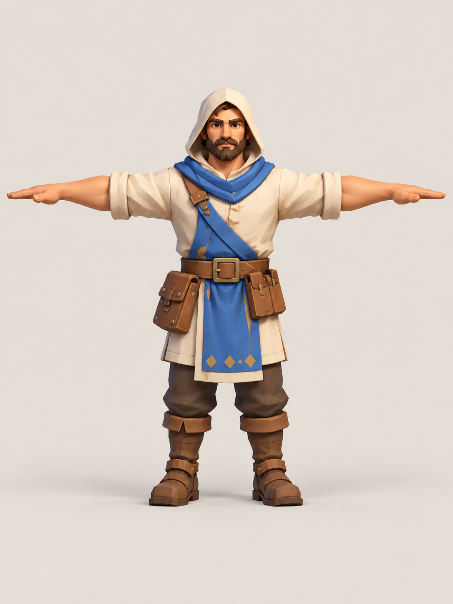
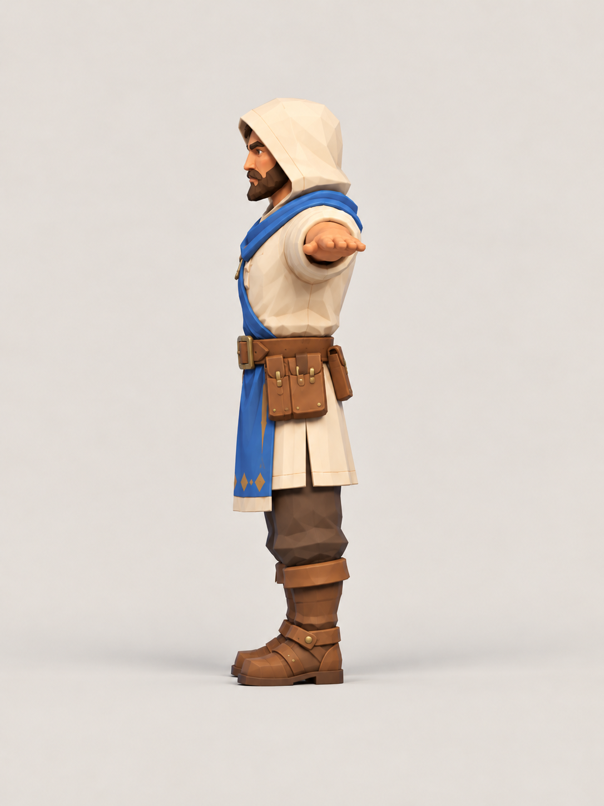
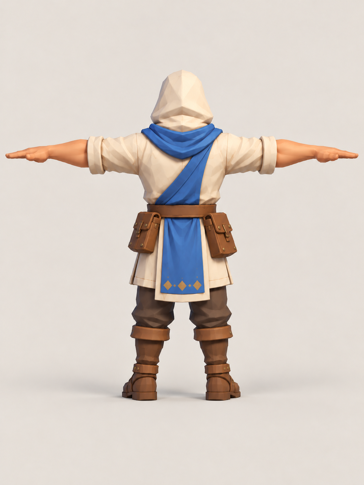
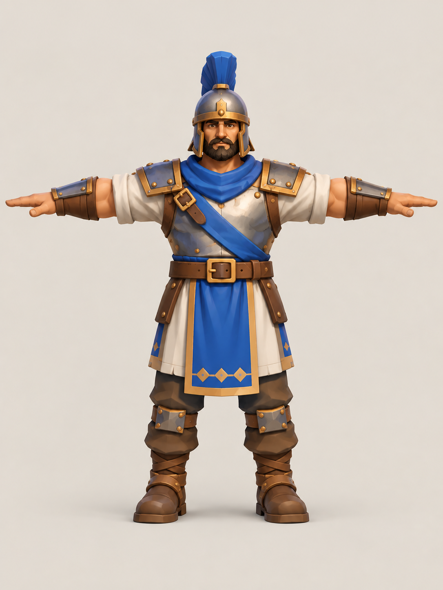
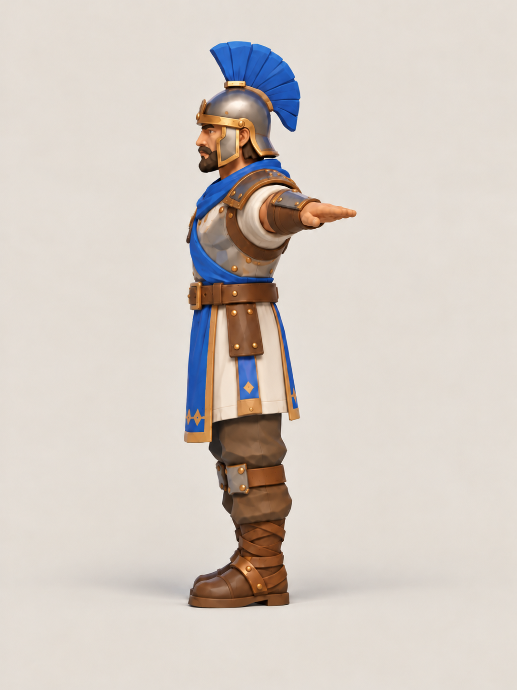
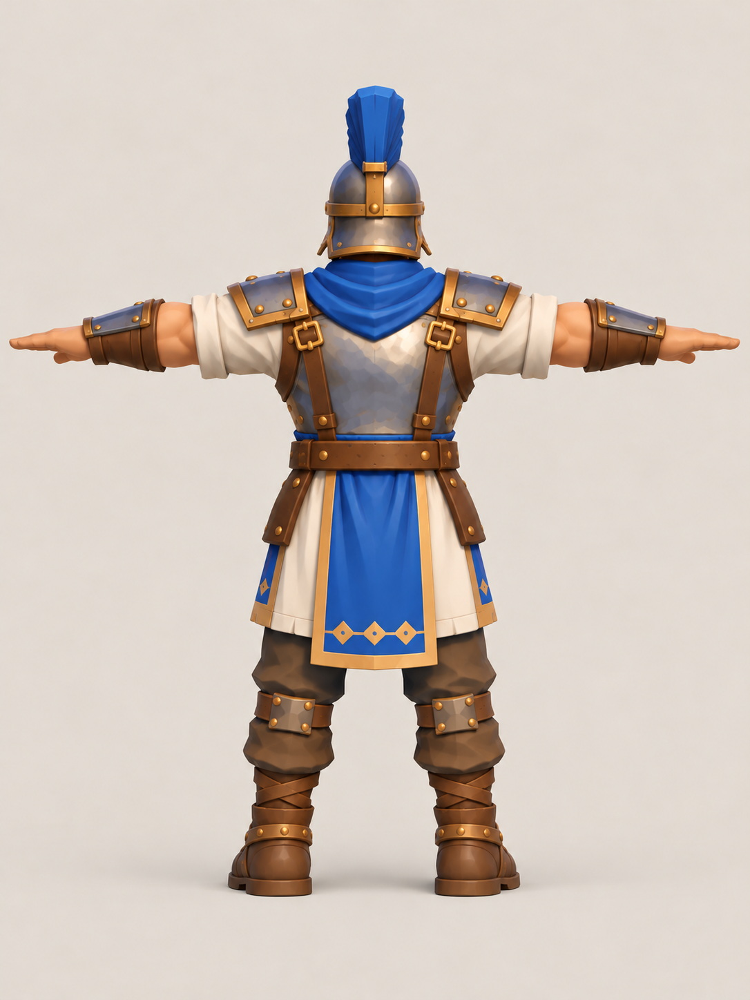

# Core #002 — Worker & Soldier turnaround references

**Статус:** пользователь выбрал этот набор как *visual reference* для Phase 1 Visual Pack (#80).  
**Дата выбора:** 2026-10-09  
**Art Direction:** [Stylized Low-Poly / Soft Hand-Painted](../../../../art-direction.md) (Cozy Settlement — единый характер **всего игрового мира**, а не отдельный стиль юнитов).  
**Назначение:** подготовка концепт-референсов для Image-to-3D / последующей ручной моделировки.

## Worker — three orthographic-like T-pose references

| Front | Side | Back |
|:---:|:---:|:---:|
|  |  |  |

## Soldier — three orthographic-like T-pose references

| Front | Side | Back |
|:---:|:---:|:---:|
|  |  |  |

## Visual contract / scope

- Один общий human-culture style и единая production-friendly форма для Worker, Soldier, зданий и окружения.
- Browser RTS: silhouette/readability first, крупные пятна цвета, ограниченная геометрия и умеренная детализация.
- Worker — чуть легче, капюшон, рукава с подворотами, utility belt / pouches, синие cloth accents.
- Soldier — чуть шире и тяжелее, металлический шлем с синим гребнем, простая броня, cloth accents.
- На turnaround-наборе Soldier **без меча и щита**, чтобы не закрывать геометрию для Image-to-3D. В gameplay его утверждённый silhouette — **короткий меч + увеличенный щит** (решение #80), как *отдельные* предметы в будущем.
- Синий на изображениях — **иллюстративный player-color accent**, не утверждённая фиксированная палитра/цвет команды.

## Technical facts

- **6 отдельных PNG**, исходное разрешение каждого **1086 × 1448**; склеенных sheet-изображений в этом каталоге нет.
- Исходные байты сохранены без resize, перекодирования или обрезки.
- Техническая проверка при подготовке: PIL `verify()` + полный `load()` каждого PNG; SHA-256 записан в `asset-manifest.json`.
- Эти файлы предназначены для art-документации и reference pipeline, **не должны попадать в runtime build**.
- Нельзя считать их готовыми UV, геометрией, ригом, нормалями, pivots, уровнями детализации или подтверждёнными бюджетами GPU/CPU.

## Multi-view limitations and acceptance gate

Изображения сгенерированы ИИ как отдельные виды и не гарантируют математически идентичные формы. В частности:

- дизайн/ориентацию гребня шлема и плечевых ремней Soldier нужно согласовать при моделировании;
- ширину тела, расположение сумок, драпировку ткани и обувь нужно сверить между ракурсами;
- профильный T-pose оценивается по правильной оси плеч; вытянутая рука видна укороченной из-за проекции, это не предписание уводить руку назад;
- симметрия и true orthographic projection не подтверждены; модели следует проверять в Blender / Image-to-3D и на normal RTS zoom.

**Approval:** утверждён именно **выбор референсов и визуальное направление**. Ни один из 3D production quality gates не выполнен.

## Provenance and rights

- Источник: OpenAI / ChatGPT image generation, концепты из проектного диалога Web RTS.
- User-curated reference set, выбран 2026-10-09 (issue #80).
- Изображения не импортированы из сторонних marketplace, не объявлены лицензированными production assets.
- Исходные имена и SHA-256 файлов — в `asset-manifest.json`.
- Модель генерации и исходные prompt/generation id для этих шести пользовательских файлов достоверно не установлены — **не придумывать**.
- Для коммерческого релиза, перепубликации raw source assets или передачи третьим сторонам нужна отдельная rights / provenance проверка; факт генерации не является записью лицензии.

## Sources of truth

- [Core #002 Visual Pack — #80](https://github.com/Web-Usov/web-rts/issues/80)
- [Art Direction v0.2](../../../../art-direction.md)
- [Curated concept references](../../../concepts/README.md)
- [create-game-assets skill](../../../../../.agents/skills/create-game-assets/SKILL.md)
