# Mesh Studio

Просмотрщик и конвертер 3D-ассетов в существующем `apps/web`, по запросу пользователя: [issue #85](https://github.com/Web-Usov/web-rts/issues/85).

Публичная страница: [web-usov.github.io/web-rts/meshy/](https://web-usov.github.io/web-rts/meshy/).

## Запуск и сборка

```bash
pnpm install --frozen-lockfile
pnpm dev
# Открыть http://localhost:5173/meshy/
pnpm build
pnpm test
pnpm typecheck
pnpm lint
pnpm build:meshy
```

Обычная сборка содержит игру и `dist/meshy/index.html`. `pnpm build:meshy` создаёт только инструмент в `apps/web/dist-pages/meshy/` с относительными URL, пригодными для GitHub Pages. Workflow `Meshy Pages` после изменений на main проверяет просмотрщик и публикует эту сборку в `gh-pages` того же репозитория. Pages настроены на корень `gh-pages`; `.nojekyll` отключает Jekyll. RTS-сервер на Pages не размещается.

## Возможности

- Открытие локальных MESHY v1, GLB, glTF с BIN/текстурами, OBJ с MTL/текстурами, STL, PLY. Для локальных составных моделей выбрать связанные файлы вместе.
- Кнопка «По ссылке»: прямая HTTP/HTTPS-ссылка, автоматическое определение формата или выбор вручную для URL без расширения. BIN/изображения glTF и MTL/изображения OBJ разрешаются относительно конечного URL после редиректа.
- Скачивание выполняется браузером без прокси, cookies и передачи файлов на сервер приложения. Сервер модели должен разрешать CORS. Подписанные ссылки работают, пока действительны; URL не сохраняется в localStorage или адрес страницы. HTTPS-страница обычно не может скачивать HTTP-файл из-за mixed content.
- Общий сетевой лимит 200 МБ, максимум 128 файлов, таймаут скачивания 2 минуты, отмена. Ошибка загрузки сохраняет текущую модель.
- Материалы, глина, нормали, каркас; свет, фон, ракурсы, сетка, оси, анимации, статистика и PNG-снимок/текстуры.
- Экспорт GLB, glTF ZIP, OBJ ZIP, бинарный STL, бинарный PLY, USDZ. Экспорт сохраняет исходные координаты и материалы независимо от режима просмотра.
- Автоскелет гуманоидов в T/A-позе: 22 кости, начальная подгонка по геометрии, выбор сустава на модели или в списке, перемещение в 3D и числовые координаты, симметрия, отмена/повтор правок.
- Автоматические веса привязки с настройкой мягкости, проверка сгиба локтей и коленей, возврат исходной позы. GLB/glTF включают скелет и два диагностических анимационных клипа.

## Создание скелета

Откройте статического персонажа, ориентированного вертикально по Y. Во вкладке «Скелет» выберите направление лица и нажмите «Создать скелет». Проверьте плечи, локти, колени и стопы; подгоните суставы стрелками в 3D или координатами. Симметрия отражает изменяемый сустав относительно центра тела. «Привязать модель» рассчитывает веса и включает проверочные сгибы. После любой правки суставов или мягкости привязку нужно пересчитать. До пересчёта экспорт GLB/glTF сообщает об этом.

Подгонка эвристическая, без ML: рассчитана на гуманоидов в T/A-позе, до 200 000 вершин. Пальцы и лицо не создаются. Для ходьбы/атаки используйте перенос готовых клипов во вкладке «Анимации». Броня и одежда могут требовать ручной доработки весов в 3D-редакторе. Модели с существующим скиннингом, анимациями, morph targets или инстансами не перезаписываются автоскелетом. При смене модели или удалении созданного скелета восстанавливается исходная геометрия.

## Библиотека и перенос анимаций

Во вкладке «Анимации» нажмите «Открыть библиотеку»: 45 движений бесплатного Universal Animation Library Standard от Quaternius. Набор CC0 хранится вместе с сайтом (GLB 3,2 МБ); сведения об источнике, зафиксированный commit, SHA-256 и упаковка находятся в `apps/web/meshy/assets/provenance.json`, полный текст лицензии — в `quaternius-CC0.txt`. Это бесплатный snapshot от 2025-06-10, без платных Pro/Source-наборов. `A_TPose` используется как справочный клип и скрыт из встроенного каталога.

Сначала откройте персонажа с ригом или создайте и привяжите автоскелет. Выберите движение источника, проверьте «Сопоставление костей», нажмите «Применить анимацию». Автоматика распознаёт имена Mesh Studio, Mixamo и Quaternius; для произвольных имён доступны два списка на каждый сустав: персонаж и источник. Поворот источника помогает согласовать направление лица. При отключении «Движение на месте» переносится перемещение таза; стартовое смещение источника убирается, вертикальное движение сохраняется. Повторное применение того же имени заменяет клип, другие клипы остаются.

«Загрузить GLB / glTF / FBX» открывает отдельный источник движения и не заменяет персонажа. Для glTF выберите BIN вместе с JSON; текстуры источника не нужны. «Загрузить по ссылке» использует прямую HTTP/HTTPS-ссылку и тот же CORS/200-МБ лимит, двухминутный таймаут и отмену. Ошибка сохраняет прежний источник и персонажа. Клипы можно переключать, ставить на паузу, менять скорость, включать повтор и возвращаться к исходной позе. GLB/glTF экспортирует все применённые клипы при включённом «Сохранить анимации».

Перенос рассчитан на одного гуманоидного персонажа с уникальными именами костей: до 256 костей, клип до 60 секунд/2048 дорожек/1 000 000 значений ключей. Используются исходные позы скелетов, коррекция направлений сегментов и пропорции; позиции суставов персонажа сохраняются, перемещение таза пересчитывается по росту ног. Нет IK для контакта стоп с землёй, переноса пальцев/лица/morph targets, универсального распознавания произвольной анатомии или редактирования весов кистью. Сложные риги могут потребовать правки в 3D-редакторе. После изменения созданного скелета пересчитайте привязку и заново примените нужные клипы.

## Границы и ограничения

Самостоятельный инструмент использует Three.js для импортёров/экспортёров; Babylon.js остаётся renderer игры (ADR-002). Инструмент не импортируется игровым entry point, simulation, protocol или transport. Новый workspace package и runtime service не добавлены.

MESHY v1 декодируется по clean-room исследованию формата (MIT). Другие версии не обещаются; криптографическая аутентификация контейнера не проверяется. Демо — предоставленный пользователем `model.meshy`, встроенный в `src/demo.js`. Лицензии библиотек и исследовательского декодера находятся в `apps/web/meshy/THIRD_PARTY_NOTICES.txt` и HTML.

GLB/glTF сохраняют поддерживаемые материалы, скелет и анимации. OBJ/STL/PLY/USDZ экспортируют текущую статическую позу; возможности материалов зависят от формата. USDZ проверен структурно, реальный Apple AR не проверен. Draco/KTX2 не настроены; такие модели могут потребовать предварительного преобразования. Meshopt поддерживается. Статический экспорт инстансов завершается явной ошибкой; для них использовать GLB/glTF. Это конвертер, без ретопологии и исправления модели для печати.

## Проверка

30 Node-тестов проверяет декодирование реального MESHY, геометрию, статический экспорт, материалы/масштаб, ошибки формата, URL, редиректы, связанные ресурсы, размер, HTTP/CORS и отмену; дополнительно — подгонку T/A-позы, зеркальное редактирование, нормализацию весов, деформацию и возврат позы, неподдерживаемые модели и повторный импорт экспортированного скелета с клипами. Они входят в `pnpm test` существующего web package.

В Codex In-app Browser проверены: реальная сетевая загрузка Khronos Duck glTF с BIN и PNG, шесть экспортов, HTTP 404, сервер без CORS, отмена, локальный MESHY, режимы просмотра и мобильная форма. На happy path console errors отсутствуют; в тесте запрета CORS ожидается браузерная диагностическая ошибка.

Для автоскелета проверены выбор сустава на модели, перетаскивание в 3D, числовая правка, симметрия, undo/redo, пересчёт привязки, сгибы и возврат позы, GLB/glTF ZIP и повторное открытие GLB с воспроизведением обоих клипов. Мобильная проверка включает подгонку, привязку и сгиб. Khronos glTF Validator: 0 ошибок для обоих экспортов; 2 предупреждения — tangent space рассчитывается в runtime, а SkinnedMesh находится внутри родительской группы. Проверка экспорта дополнена фактическим повторным импортом и тестом исходных координат.

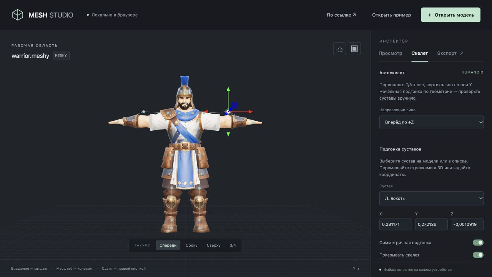
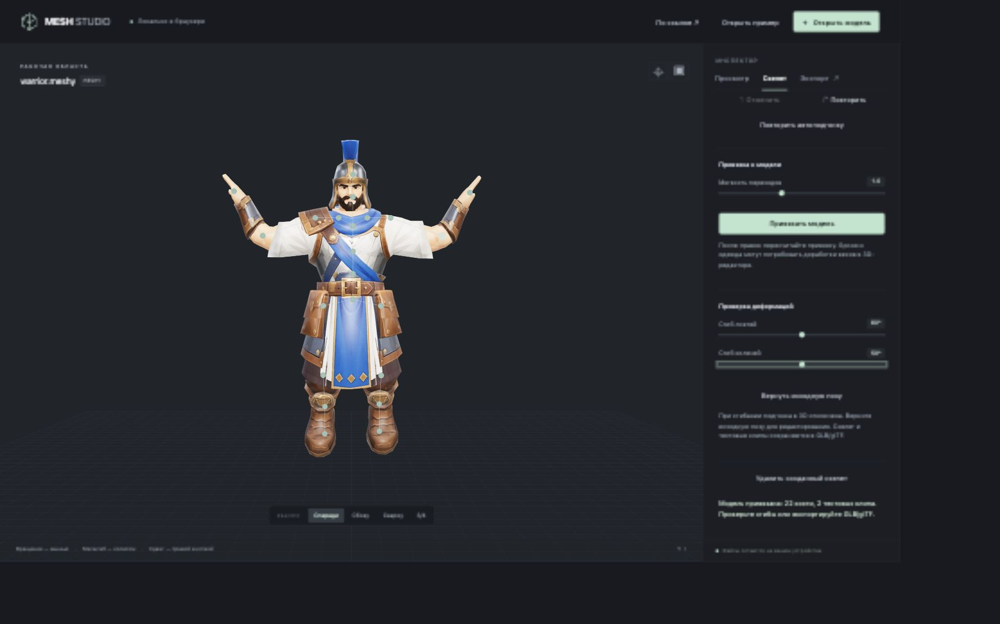
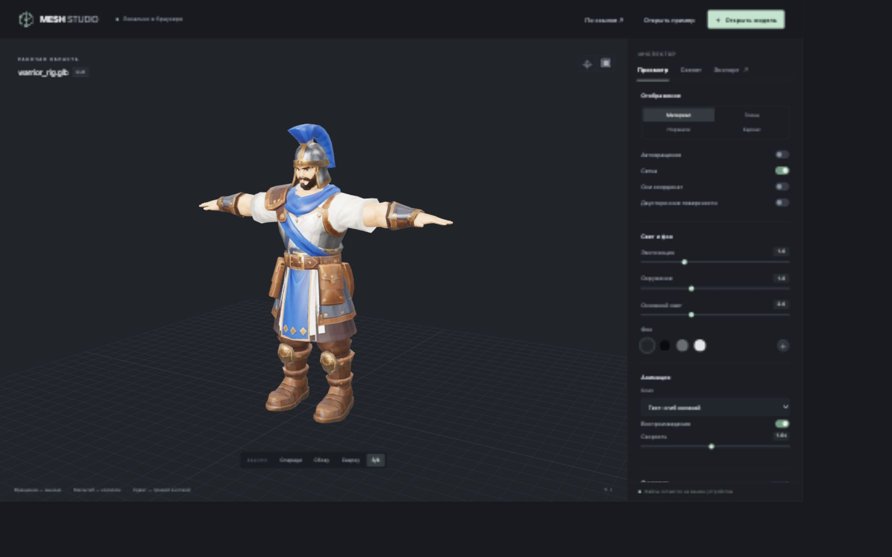
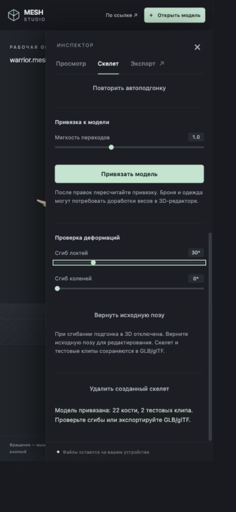

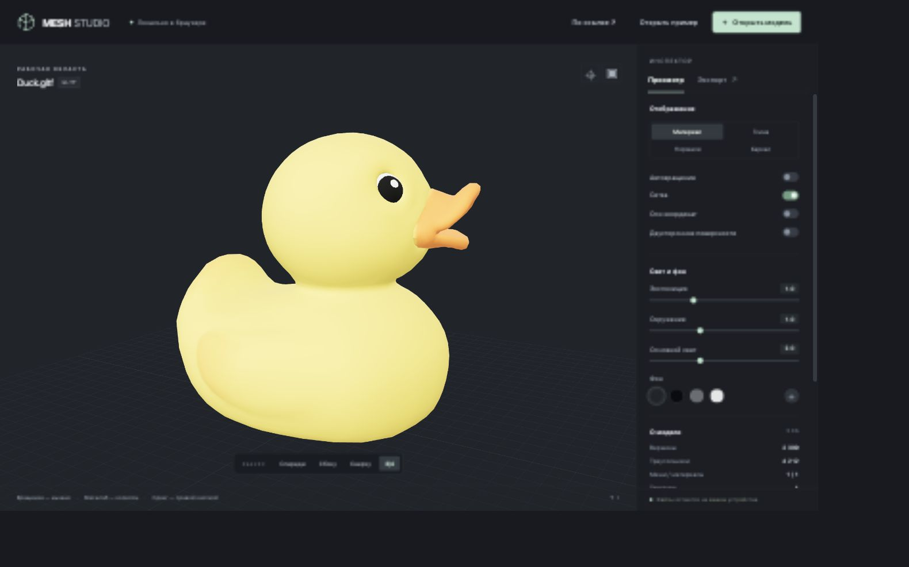
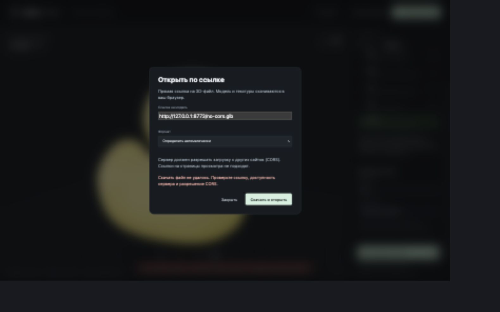
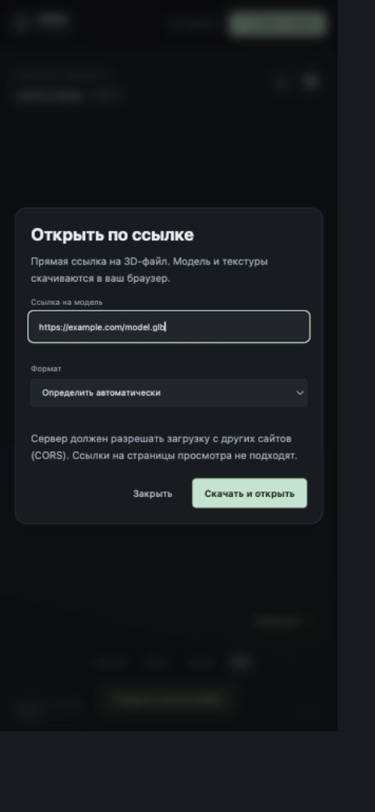

## Проверка переноса движений

Node-тесты проверяют перенос всех 45 встроенных действий, распознавание 22 суставов, конечные нормализованные quaternion, неизменность входных объектов, сохранение длин сегментов, масштаб перемещения таза и режим на месте, ручные имена/ошибки карты, удаление постоянного смещения первого кадра FBX, отдельный GLB/glTF+BIN без текстур, экспорт и повторный импорт ходьбы/удара. Сетевые regression tests покрывают FBX, отклонение статических форматов, общий лимит и отсутствие запросов к ненужным текстурам анимации.

В Codex In-app Browser проверены встроенная ходьба и удар, отдельный локальный FBX Mixamo, перенос на уже импортированный риг, скорость/однократное действие и перемещение таза, glTF с внешним BIN по URL, FBX по URL, незаполненная карта и её восстановление, HTTP 404 и отмена, GLB/glTF ZIP с пятью клипами, повторное открытие GLB и воспроизведение ходьбы. Ошибок console/runtime в этих сценариях нет; FBXLoader предупреждает о сокращении более четырёх весов источника (геометрия источника не переносится). Khronos glTF Validator: 0 ошибок в обоих экспортированных файлах, 2 прежних предупреждения о tangent space и родительской группе SkinnedMesh.

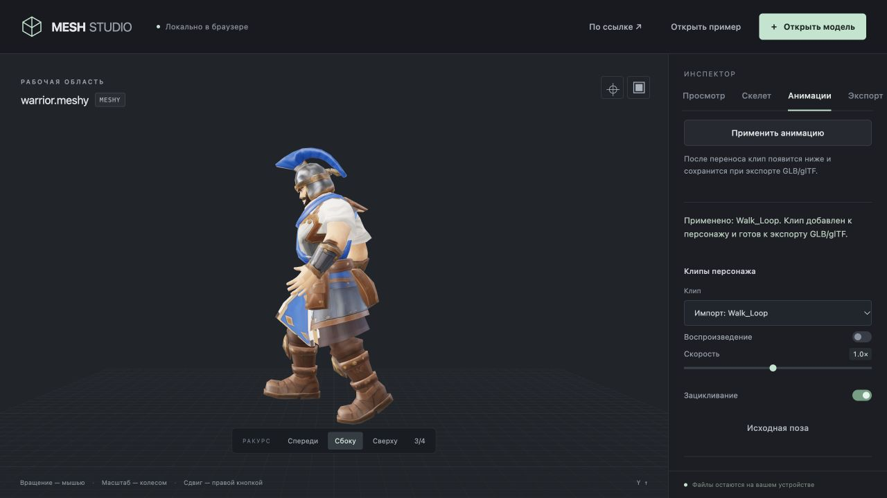
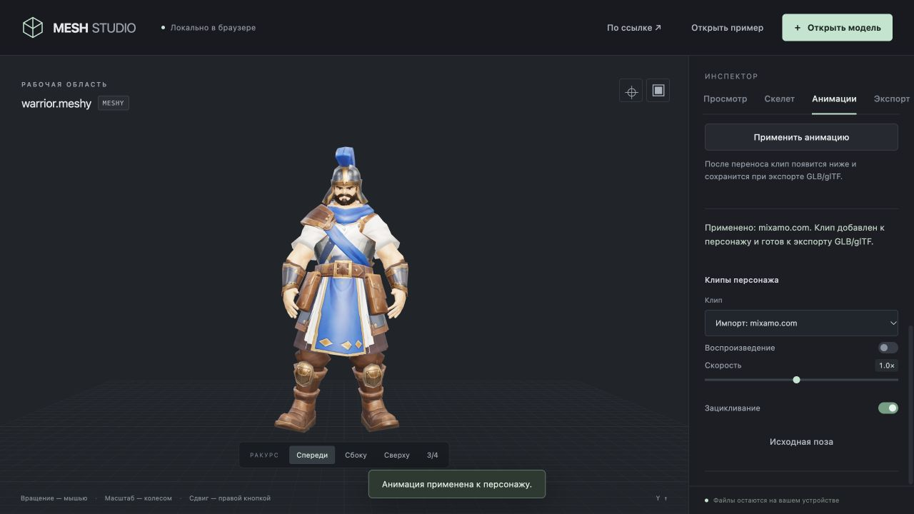
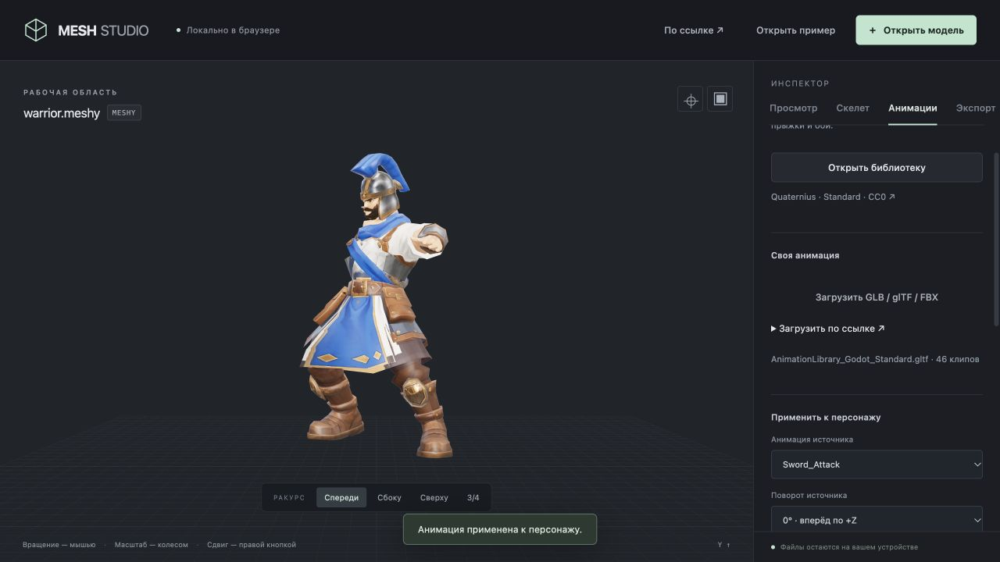
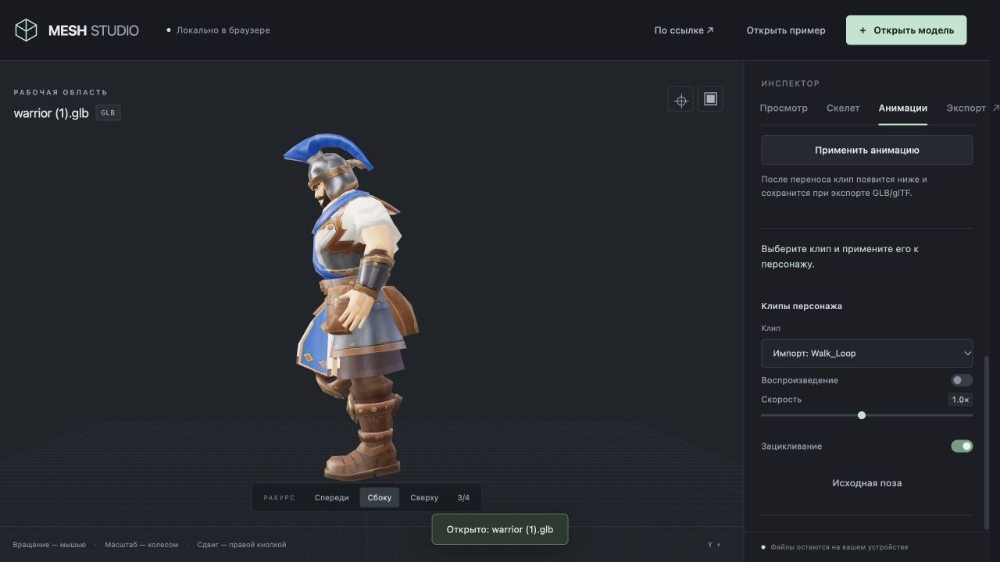

Мобильная проверка новой панели ограничена средой: viewport override внутреннего браузера возвращает прежние 1280×720 вместо запрошенных 390×844. Фактическое мобильное прохождение новой панели не заявляется; четырёхвкладочный header проверен на рабочем размере без переполнения.
