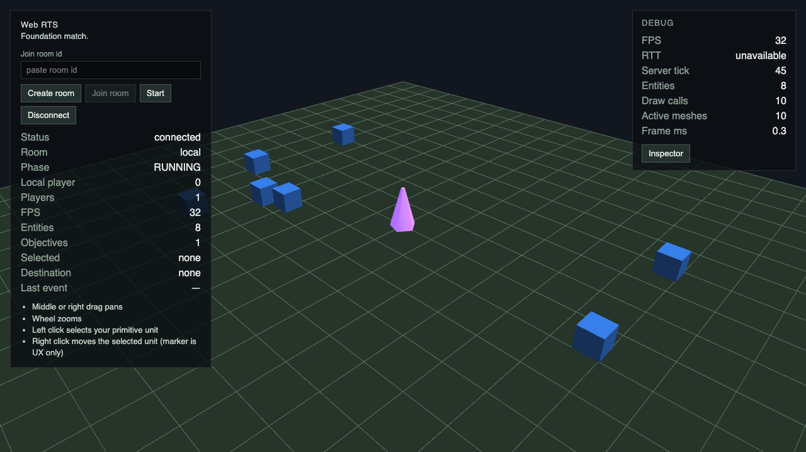
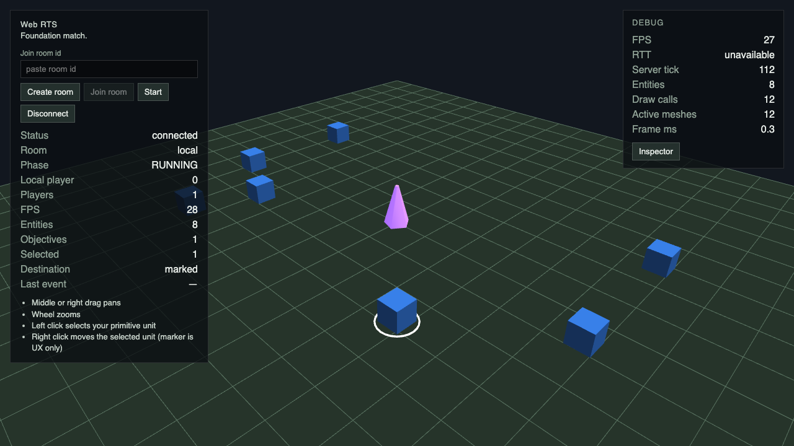
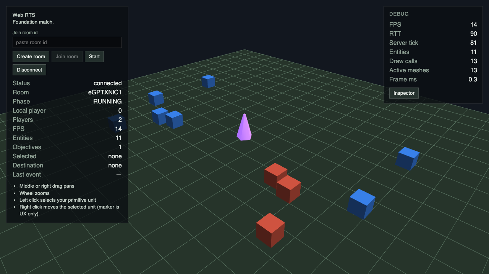
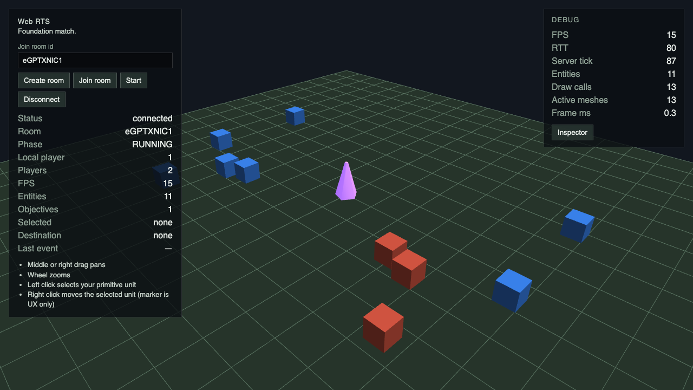
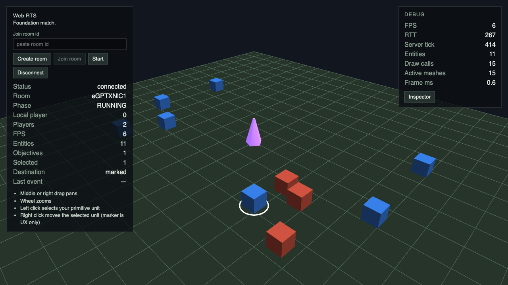
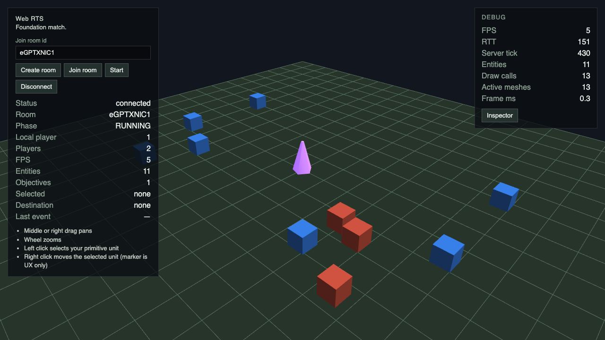

# G5 / #58: экономика и проверка

Контракт: [Spec #002](../../specs/002-first-economy-defense-vertical-slice.md), §9–10, §12, §22.4/22.6/22.8 и ADR-008/009.

## Решения

- Foundation unit и его стабильный порядок bootstrap сохранены. Каждый player дополнительно получает один Worker и один owned Town Hall; карта содержит четыре finite Wood nodes. Координаты и balance — `game-data`.
- Stockpile принадлежит Worker Owner. Controller определяет право принять команду, original issuer получает correlation/failure event.
- Drop-off выбирается при принятии GATHER: минимальная достижимая grid distance от текущей cell Worker, затем entityId, затем row-major approach cell. Один grouped A* с нулевой heuristic одновременно проверяет source и выбирает drop-off; это одна command query, без серии A* по кандидатам.
- Выбранный drop-off закреплён за task. Его потеря/смена owner/capability завершает task через `ACTION_FAILED(no_dropoff)` с сохранением carry. Новую возможность использует только новая явная команда.
- Отсутствующая task означает IDLE. Deposit — атомарный переход при фактическом достижении approach cell. Source depletion завершает последний deposit; source removal с пустым carry даёт `target_removed`, с carry — последний deposit и IDLE.
- Integer stock/carry и fractional tick-rate accumulator не создают и не дублируют Wood. MOVE снимает task, сохраняя carry; rejected replacement ничего не снимает.
- Worker transitions и movement replans проходят одним ascending entityId traversal и одной `EntityPathQueryLane`. Следующая leg откладывается до следующего tick, exhausted lane не вызывает потерю carry или ложный arrival. Replan использует актуальный approach goal set, без телепортации.
- MatchSnapshot возвращает defensive economy/resource/carry copies. ACTION_FAILED и G5-only reasons не выдаются за wire COMMAND_REJECTED. Protocol version и публичный command set сохранены; projection/interaction/HUD — G11/G12.

## Browser verification

Внутренний инструмент: `mcp__cua_repl`, Codex In-app Browser.

Local: `/?transport=local` → Create room → Start → RUNNING, 8 entities и 1 objective → выбрать Foundation unit → right-click MOVE → наблюдать continuous movement и destination marker. Remote: тот же flow через Colyseus transport. В обоих игровых flows проверены browser logs: error/warn отсутствуют. Internal GATHER проверен headless simulation/scenario tests; production UI для него не добавлен.

Playwright дополнительно проверяет Local Worker, multiplayer наблюдение MOVE из двух browser contexts, reconnect/reload, диагональную прямую траекторию и blocked target. Screenshot helper выделяет original Foundation unit как связную область пикселей среди новых generic proxy meshes. Репрезентативные кадры ниже сохранены Playwright для тех же игровых состояний, которые проверены внутренним браузером.

