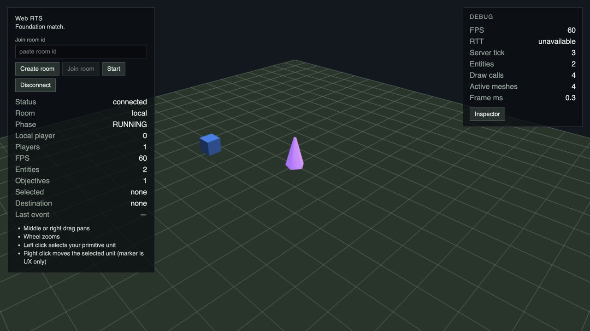
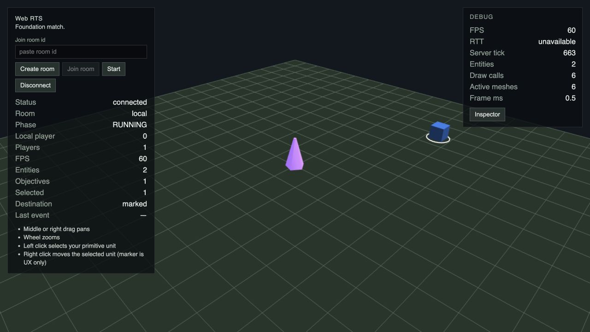
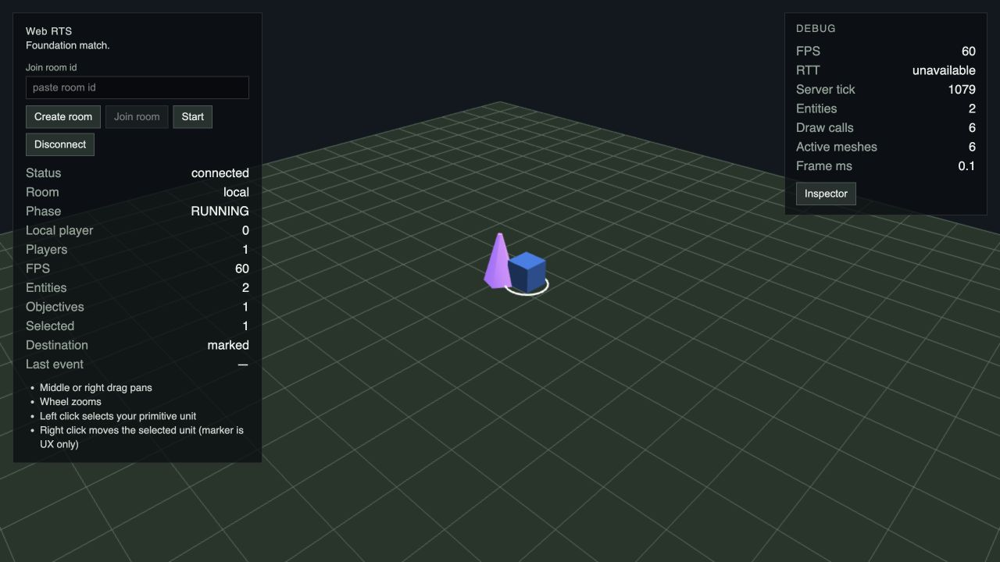
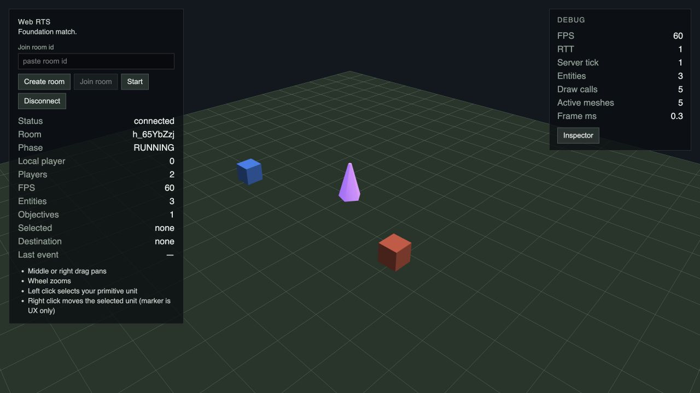
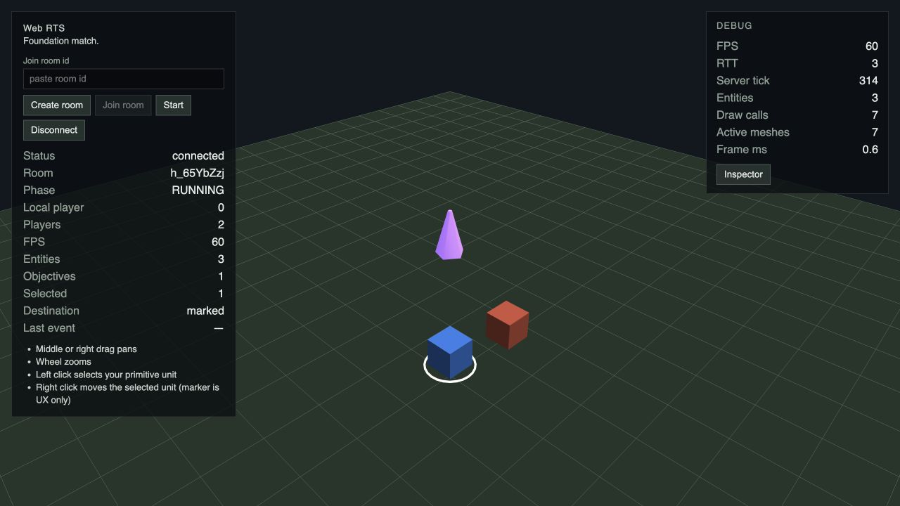
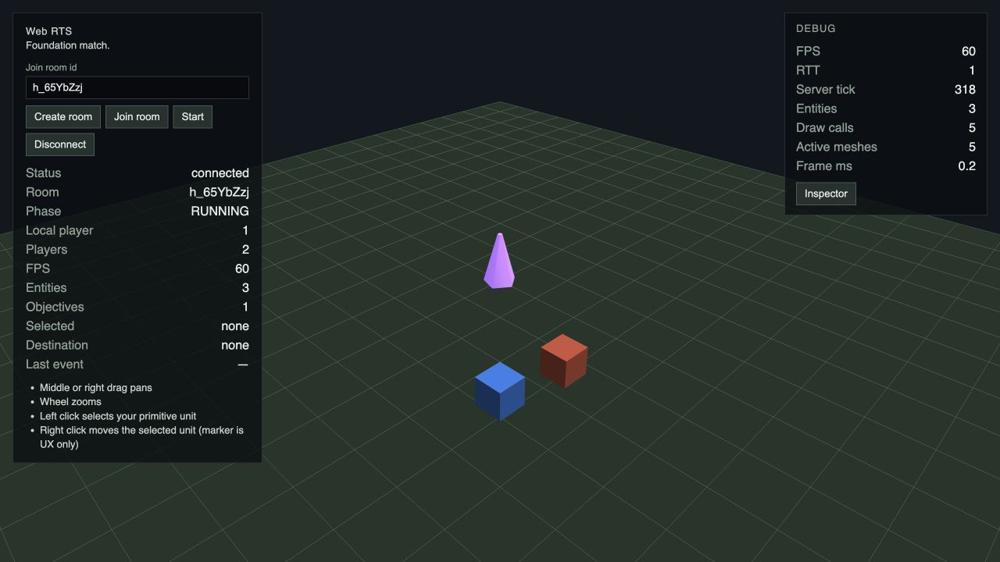

# G4b — scheduler / path budgets, проверка #68

Контракт: Gameplay Spec #002 §8.8, §22, §25; ADR-008 и ADR-009. Navigation semantics G4a сохранены.

## Configuration и scheduling

Defaults: `maxPendingCommandsPerPlayer=32` (без изменения), `maxCommandsPerTick=16`, `commandBudget=16`, `activeTaskBudget=8`, `aiBudget=8`, `maxPathQueriesPerTick=32`.
Все caps/budgets — positive safe integers; сумма lanes должна быть safe integer и не превышать total.
Максимальная wire-группа MOVE (16 IDs) помещается в свежий command lane. `createGameplayRuntime` в match-adapter проверяет cross-package invariant при создании production Local/Remote runtime; simulation не импортирует protocol. Низкоуровневый `createMatchRuntime` принимает transport-neutral simulation options третьим аргументом.

Scheduler посещает ascending playerId cyclic order, одну head за round, strict FIFO. Начало следующего tick сдвигается на одного participant относительно начала предыдущего tick, в том числе после полного round/idle tick. Cursor хранит playerId; после удаления выбирается следующий ascending participant с wrap. Пустая queue не меняет порядок. Непомещающаяся head остаётся на месте; меньшая peer head может исполниться. Стоимость резервируется до validation, без refunds при rejection. Нулевые стоимости также ограничены maxCommandsPerTick. Внутренний future cost API фиксирует GATHER/BUILD/GARRISON=1, UNGARRISON=0, не добавляя gameplay/wire commands.

Movement сортирует entities по ID и сохраняет проверку каждого newly active segment. Безопасные пути не тратят query; unsafe segment запрашивает active-task lane до displacement. При отказе task сохраняется и ждёт следующего tick. После выполненного no-route replan task прекращается как в G4a. `EntityPathQueryLane` — внутренний API будущего G9: ascending requests, максимум одна query на entity за tick, новый объект lane на каждый tick, без borrowing или partial A* state. AI поведения ещё нет, production aiQueries=0.

`readMetrics()` возвращает fresh plain diagnostics последнего tick: processedCommands, reservedCommandPathCost, commandBudgetUsed/Remaining, activeTaskQueries, aiQueries, плюс existing counters. Used — reservation, а не фактическое число A*. Snapshot/GameStateView/protocol не расширяются.

Defaults консервативны для текущей 40×40 Foundation: одна максимальная группа за tick, 8 независимых replans, резерв 8 query для G9. Они не являются CPU SLA на больших картах.

## Benchmark

Воспроизведение после `pnpm build`:

```sh
node scripts/benchmark-navigation.mjs docs/verification/68-g4b/benchmark.json
```

Среда: Node v22.22.3, macOS/darwin arm64, Apple M1. Обычный compiled TypeScript JS, без instrumentation timings внутри simulation. Финальный прогон выполнен без параллельных tests/build; idle dev server/browser остаются, ОС не изолирована. 5 warm-ups и 30 timed samples на workload; percentile — nearest rank. GC/outliers включены. Это diagnostic baseline, не CI timing gate и не полный simulation-tick benchmark.

48 workloads: 40/80/128/256, connected/partitioned, reachable/blocked, группы 1/8/16. 40×40 использует реальную FOUNDATION_MAP и footprint Sacred Site. Большие карты — synthetic open grid с 2×2 центральным solid. Partitioned вариант добавляет full-height wall на x=size/2+2 и оставляет source component примерно в половину карты. Начальные точки 40×40 возле spawn (-6,-3); на больших картах возле нижнего левого угла. Группа имеет distinct origins с offsets 0.1. Reachable target (-1.5,-1.5), blocked target (0,0). Каждый sample последовательно планирует всю группу, включая fallback + A* + smoothing, без кеша. Отдельный untimed run собирает counters и проверяет repeatability effective destinations. Время bootstrap/grid setup не включено.

| Размер | Layout | Target | Group | min ms | p50 ms | p95 ms | max ms | A* expanded | Component visited |
| --- | --- | --- | --- | --- | --- | --- | --- | --- | --- |
| 40 | connected | reachable | 1 | 0.037 | 0.04 | 0.243 | 0.307 | 6 | 0 |
| 40 | connected | reachable | 8 | 0.109 | 0.141 | 0.296 | 0.31 | 48 | 0 |
| 40 | connected | reachable | 16 | 0.16 | 0.254 | 0.503 | 0.703 | 96 | 0 |
| 40 | connected | blocked | 1 | 0.078 | 0.096 | 1.37 | 2.826 | 7 | 1596 |
| 40 | connected | blocked | 8 | 0.668 | 0.814 | 1.39 | 2.363 | 56 | 12768 |
| 40 | connected | blocked | 16 | 1.321 | 1.634 | 2.338 | 2.438 | 112 | 25536 |
| 40 | partitioned | reachable | 1 | 0.004 | 0.007 | 0.01 | 0.011 | 6 | 0 |
| 40 | partitioned | reachable | 8 | 0.031 | 0.038 | 0.109 | 0.234 | 48 | 0 |
| 40 | partitioned | reachable | 16 | 0.059 | 0.087 | 0.151 | 0.156 | 96 | 0 |
| 40 | partitioned | blocked | 1 | 0.044 | 0.06 | 0.114 | 0.225 | 7 | 876 |
| 40 | partitioned | blocked | 8 | 0.356 | 0.418 | 0.658 | 1.113 | 56 | 7008 |
| 40 | partitioned | blocked | 16 | 0.716 | 0.958 | 1.216 | 1.405 | 112 | 14016 |
| 80 | connected | reachable | 1 | 0.091 | 0.108 | 0.459 | 0.598 | 73 | 0 |
| 80 | connected | reachable | 8 | 0.242 | 0.316 | 0.918 | 1.013 | 584 | 0 |
| 80 | connected | reachable | 16 | 0.475 | 0.578 | 0.856 | 0.98 | 1168 | 0 |
| 80 | connected | blocked | 1 | 0.318 | 0.369 | 0.766 | 0.766 | 74 | 6396 |
| 80 | connected | blocked | 8 | 2.79 | 3.33 | 4.139 | 4.423 | 592 | 51168 |
| 80 | connected | blocked | 16 | 6.109 | 6.856 | 7.838 | 8.128 | 1184 | 102336 |
| 80 | partitioned | reachable | 1 | 0.034 | 0.037 | 0.043 | 0.048 | 73 | 0 |
| 80 | partitioned | reachable | 8 | 0.241 | 0.26 | 0.348 | 0.573 | 584 | 0 |
| 80 | partitioned | reachable | 16 | 0.48 | 0.561 | 1.089 | 1.798 | 1168 | 0 |
| 80 | partitioned | blocked | 1 | 0.186 | 0.205 | 0.572 | 0.653 | 74 | 3356 |
| 80 | partitioned | blocked | 8 | 1.504 | 1.846 | 2.406 | 2.493 | 592 | 26848 |
| 80 | partitioned | blocked | 16 | 3.369 | 4.061 | 5.301 | 6.2 | 1184 | 53696 |
| 128 | connected | reachable | 1 | 0.062 | 0.066 | 0.086 | 0.098 | 121 | 0 |
| 128 | connected | reachable | 8 | 0.414 | 0.474 | 0.762 | 1.184 | 968 | 0 |
| 128 | connected | reachable | 16 | 0.819 | 0.95 | 1.318 | 1.578 | 1936 | 0 |
| 128 | connected | blocked | 1 | 0.883 | 1.106 | 1.651 | 4.696 | 122 | 16380 |
| 128 | connected | blocked | 8 | 7.959 | 9.534 | 11.163 | 11.975 | 976 | 131040 |
| 128 | connected | blocked | 16 | 17.335 | 18.04 | 21.043 | 21.477 | 1952 | 262080 |
| 128 | partitioned | reachable | 1 | 0.056 | 0.057 | 0.07 | 0.072 | 121 | 0 |
| 128 | partitioned | reachable | 8 | 0.421 | 0.468 | 0.757 | 1.812 | 968 | 0 |
| 128 | partitioned | reachable | 16 | 0.827 | 0.972 | 1.584 | 1.85 | 1936 | 0 |
| 128 | partitioned | blocked | 1 | 0.433 | 0.521 | 1.065 | 1.122 | 122 | 8444 |
| 128 | partitioned | blocked | 8 | 4.109 | 4.573 | 5.342 | 5.529 | 976 | 67552 |
| 128 | partitioned | blocked | 16 | 8.808 | 9.421 | 10.276 | 10.289 | 1952 | 135104 |
| 256 | connected | reachable | 1 | 0.12 | 0.137 | 0.18 | 0.378 | 249 | 0 |
| 256 | connected | reachable | 8 | 0.915 | 1.137 | 1.784 | 2.315 | 1992 | 0 |
| 256 | connected | reachable | 16 | 1.933 | 2.331 | 3.265 | 3.568 | 3984 | 0 |
| 256 | connected | blocked | 1 | 6.012 | 9.794 | 13.843 | 16.114 | 250 | 65532 |
| 256 | connected | blocked | 8 | 73.663 | 82.174 | 94.192 | 94.255 | 2000 | 524256 |
| 256 | connected | blocked | 16 | 152.317 | 162.554 | 174.291 | 175.809 | 4000 | 1048512 |
| 256 | partitioned | reachable | 1 | 0.129 | 0.147 | 1.247 | 1.778 | 249 | 0 |
| 256 | partitioned | reachable | 8 | 0.975 | 1.201 | 1.913 | 2.051 | 1992 | 0 |
| 256 | partitioned | reachable | 16 | 2.041 | 2.346 | 3.27 | 3.722 | 3984 | 0 |
| 256 | partitioned | blocked | 1 | 2.043 | 3.058 | 6.167 | 7.538 | 250 | 33276 |
| 256 | partitioned | blocked | 8 | 26.179 | 31.938 | 36.2 | 38.182 | 2000 | 266208 |
| 256 | partitioned | blocked | 16 | 56.365 | 66.106 | 84.634 | 87.594 | 4000 | 532416 |

На connected 256×256 одна группа 16 выполняет 1 048 512 component visits и превышает 100 ms tick interval уже по p50. Query-count budget ограничивает число поисков, но не их CPU work. На Foundation 40×40 результаты позволяют оставить commandBudget=16; перенос этих defaults на большие карты требует profiling. Active/AI lanes также могут выполнять дорогие searches; sum query cap не доказывает общий CPU upper bound.

## Предложение отдельной issue

Название: **Navigation — снизить стоимость blocked-target resolution на больших картах без изменения nearest-reachable контракта**.

Рекомендуемый первый шаг: отдельно проверить кеш connected-component labels по topologyRevision и переиспользование данных reachable component для нескольких units группового MOVE. Для blocked target выбирать ту же world-space projection и row-major tie-break внутри компоненты; effective destination на accepted task фиксируется как прежде. Измерить также rebuild cost при частых topology changes: кеш не гарантирует bounded worst-case tick. Добавить partitioned/group atomicity/determinism и topology invalidation tests; сравнить все 48 workloads и полный tick при нагрузке всех lanes. Не вводить ранние exits и не менять MOVE cost в этом PR.

Если потребуется новый work-unit budget или resumable search, сначала отдельные Spec #002 §8.8 / ADR-008 изменения и review. Текущий G4b сохраняет approved query-count semantics и явно не обещает bounded CPU time. Breach-aware search/G9/UX #82 остаются вне scope.

## Automated verification

`pnpm lint`, `pnpm typecheck`, `pnpm test` (260 tests), `pnpm test:server` (40 integration tests), `pnpm build` — green. `pnpm test:e2e` — 6/6 green: debug, Local, diagonal, blocked target, multiplayer, reconnect. Tests покрывают rounds/FIFO 2–4 players, cursor/removal/wrap, spam, reservation/no refunds, oversized remaining head, synthetic zero-cost future intent, config и startup invariant, independent entity lanes, ascending movement order, safe deferral включая later segment, safe paths/unrelated topology, blocked group repeatability и existing G4a atomicity. Local и Remote проверены отдельными shell tests против общей fixture из 20 commands с 16 rejections в первом tick.

## Визуальная проверка

Инструмент: внутренний `mcp__cua_repl`, Codex In-app Browser, desktop viewport 1280×720. Web/server подняты из task worktree. Local: Create room → Start → выделение unit → свободная диагональ → blocked-target к Sacred Site. Remote: две вкладки → create/join → Start → MOVE игрока 0, наблюдение с обоих клиентов. Кадры ниже фиксируют начальное состояние и результаты. Console/runtime ошибки финального flow проверены через tab.dev.logs.







