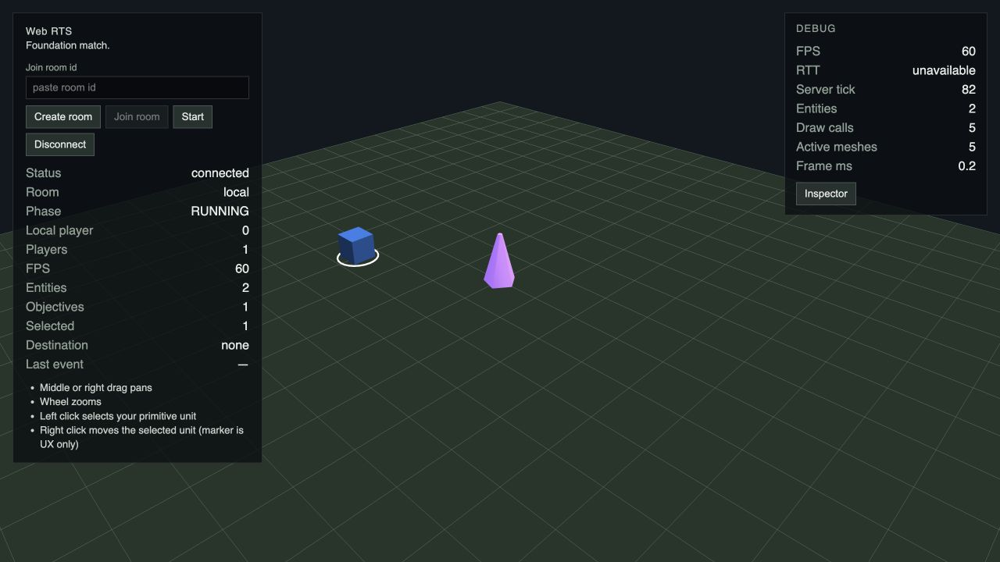
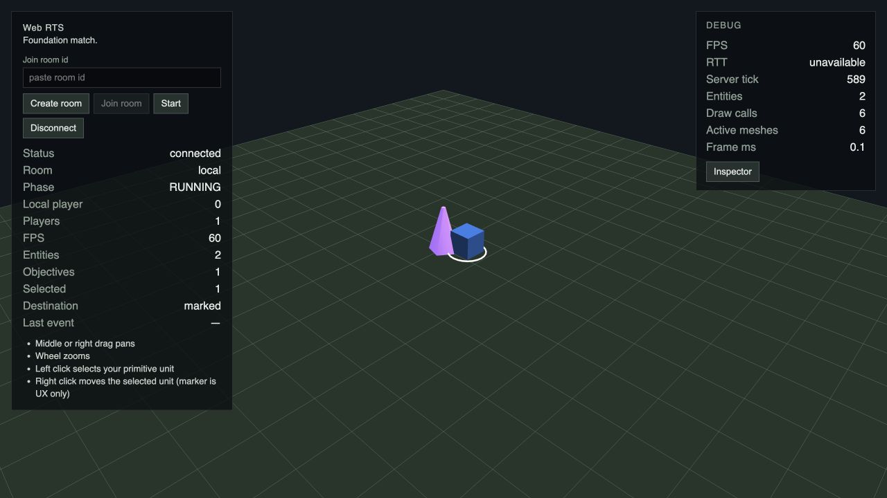
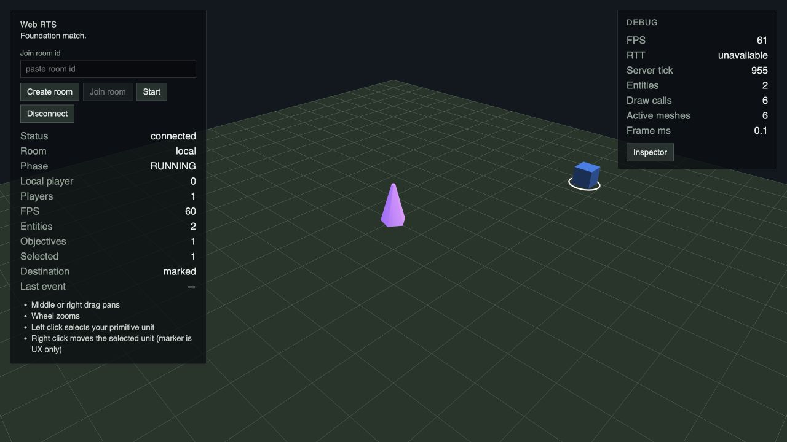
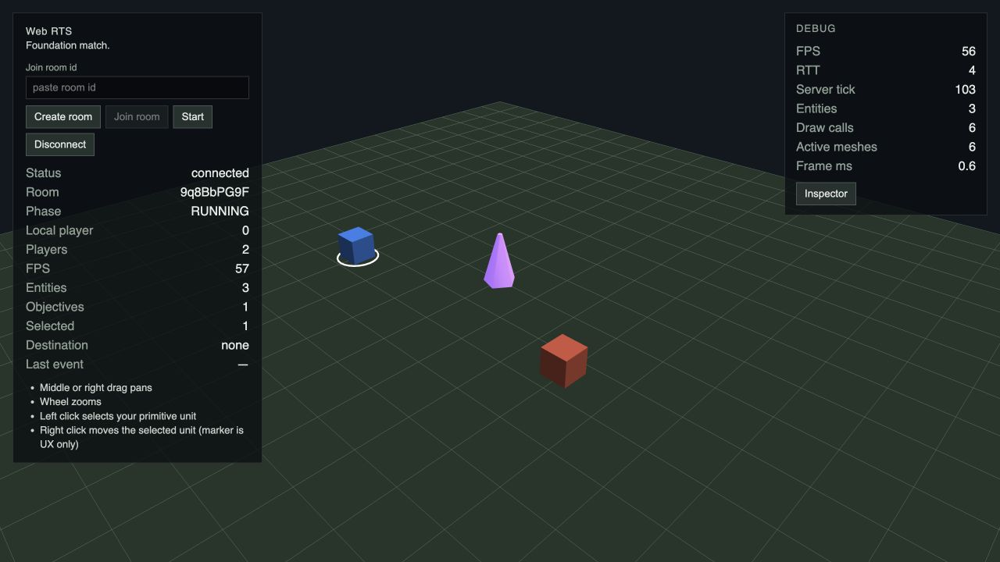
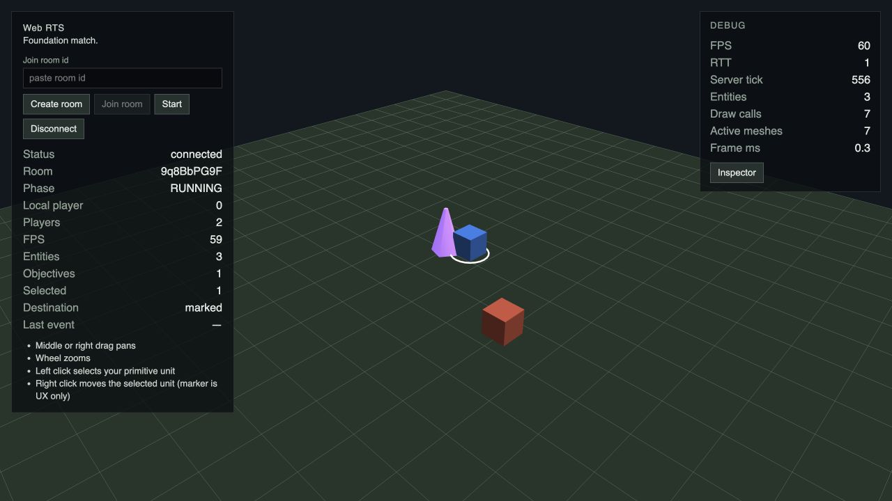
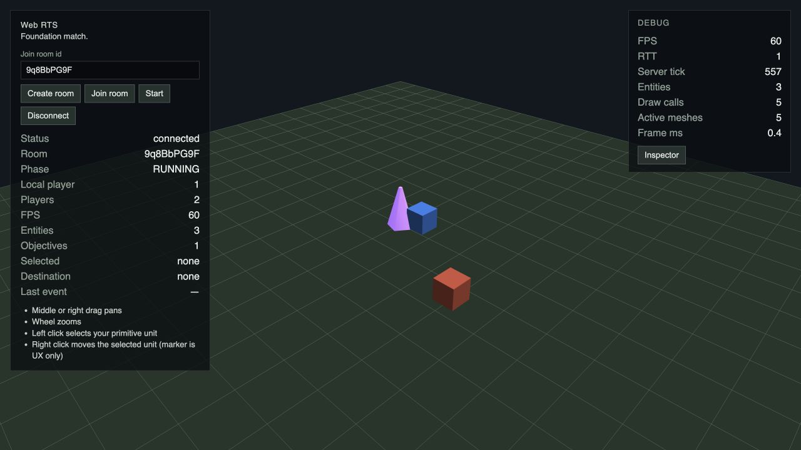
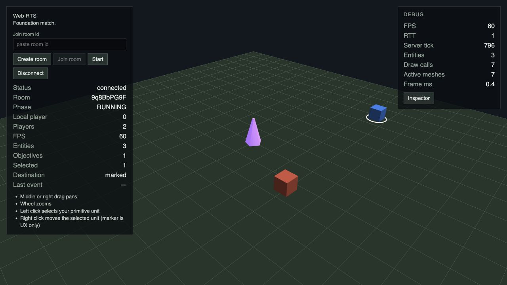
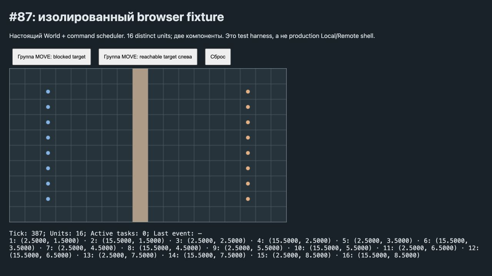
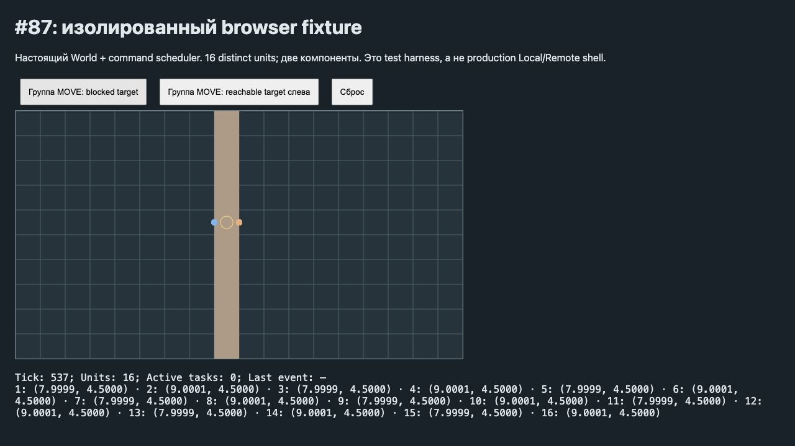
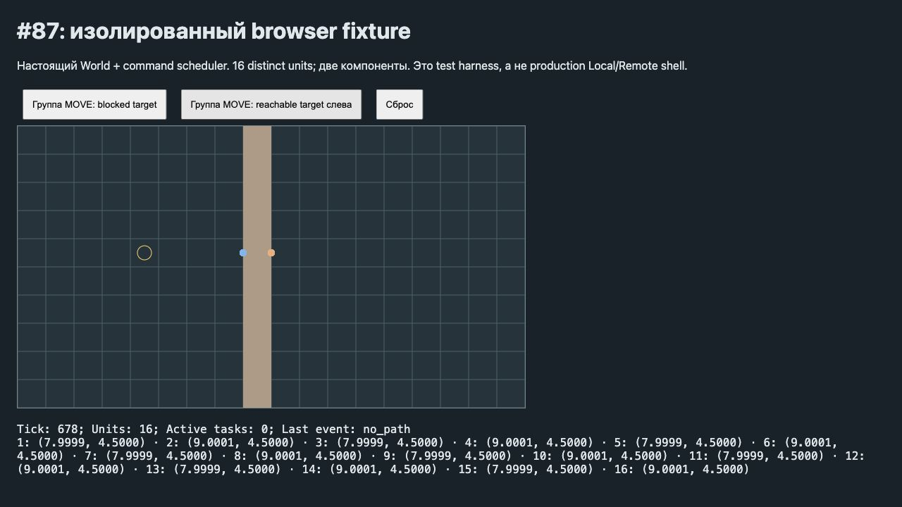

# #87 — CPU blocked-target navigation

Контракт: Issue #87; Spec #002 §8.1–8.8, §22, §25, §27, §29; ADR-004/008/009.

## Baseline до изменения алгоритма

`origin/main`: `9507da838f6519c1ce3b0f05e3ddbf20170a8bfc`. Алгоритм navigation не изменён. Apple M1, 8 logical CPUs, 16 GiB RAM, macOS Darwin 24.6.0 arm64, Node **v25.9.0**, pnpm 10.8.1. Это другое runtime, чем исторический Node 22 baseline #68; сравнение before/after будет внутри текущего runtime.

```sh
pnpm install --frozen-lockfile
pnpm build
node scripts/benchmark-navigation.mjs docs/verification/87-navigation-cpu/before-matrix.json
node --expose-gc scripts/benchmark-navigation-tick.mjs docs/verification/87-navigation-cpu/before-tick.json
node --expose-gc scripts/benchmark-navigation-lifecycle.mjs docs/verification/87-navigation-cpu/before-lifecycle.json
```

Прогоны последовательные, без tests/build/dev processes одновременно. ОС не изолирована. Compiled JS; 5 warm-ups, 30 samples; nearest-rank p50/p95, min/max, GC/outliers включены. Setup исключён; deterministic counters собраны отдельно от timings. Hardware timing не является CI assertion.

`before-matrix.json` — исходная 48-workload matrix без изменений: 40/80/128/256 × connected/partitioned × reachable/blocked × 1/8/16. Fallback+A*+smoothing, distinct continuous origins. Connected 256/16 blocked: **81.841 / 97.503 ms p50/p95**, min 73.755, max 108.933; 1 048 512 component visits, 4 000 A* expansions. Результат historical #68 (162.554 / 174.291) не заменяется этим baseline.

`before-tick.json` разделяет:

- **production** `MatchRuntime.step()` — настоящий Foundation 40×40, 4 players × 4 single-unit commands, cost=16. Переданный mapId намеренно не меняет карту. p50/p95 **1.648 / 2.862 ms**. Production AI отсутствует, activeTaskQueries=0, aiQueries=0.
- **synthetic full tick** — isolated `World` на 40/80/128/256, настоящий `scheduleCommands`, command application, `World.step()` movement/replan, event drain, затем явно синтетический AI lane. 16 distinct units группового MOVE + 8 accepted active tasks с unsafe segments + 12 AI requests, из которых budget разрешает 8, ascending IDs, max one query/entity. Command reservation=16, activeTaskQueries=8, synthetic aiQueries=8; lanes независимы. AI queries используют blocked resolution как дорогой synthetic workload, а не существующий G9 AI. Отдельный 256 workload содержит 16 single commands вместо одного group MOVE. Production snapshot/replication в synthetic harness не добавлены.

Connected 256 saturated tick: **114.360 / 123.008 ms**; churn **115.296 / 131.841 ms**; 16 single commands **111.841 / 123.081 ms**. Все превышают 100 ms интервал уже по p50. Distinct-components вариант использует full-height wall и alternating origins по её сторонам; effective destinations различаются. Churn включает успешный add/remove solid и последующий navigation work; active segment был отдельно invalidated при setup.

`before-lifecycle.json` — single/group requests на одном grid: cold/warm, add/remove + resolution, 10 повторных MOVE при стабильной topology. В baseline persistent cache отсутствует: cold/warm оба вычисляют компоненту снова, retained cache=0, rebuild означает следующий полный обход после изменения topology. Результаты включают отдельно измеренные deterministic counters.

Memory: `heapDeltaBeforeGC` — end-of-call heap delta, **не peak и не total allocations**; `heapDeltaAfterGC` содержит retained routes/world state и шум V8, может быть отрицательной. `arrayBufferDelta` зависит от момента finalization V8. Дополнительно lifecycle собирает approximate allocated heap bytes через Node HeapProfiler sampling (32 KiB, включая собранные GC objects), отдельно от timings. Это статистическая оценка temporary allocations, не точный byte accounting; typed-array backing stores учитываются отдельно структурной оценкой. Baseline не удерживает resolution cache между requests.

Baseline сохраняется отдельным коммитом до production algorithm changes.

## A/B и выбранное решение

Baseline закоммичен отдельно (`6e7a0c1`), затем измерен A (`b1a041f`), затем реализован B (`fe42049`). SHA после rebase на актуальный main; исходные environment revisions в baseline/A JSON относятся к моменту замеров до rebase. Final after JSON повторно собраны на `f48fe9d5500b3906f12d3158f63d788bc25d152a` после rebase. Последующие изменения — verification/report, не алгоритм. Полные 48 строк before/A/B опубликованы в соответствующих `*-matrix.json`; у B каждая строка также содержит fresh-grid `cold`, а основная строка — stable-grid warm.

A повторно использует resolution внутри одного MOVE по компонентам, сохраняя отдельный A* и smoothing для каждого origin. Для одной группы эффект велик, но 16 отдельных commands всё ещё повторяют flood-fill: full tick p95 232.505 ms, включая outliers. Поэтому A недостаточен для насыщенных независимых lanes и повторных команд.

B сохраняет group-scoped effective destinations и добавляет lazy labels на конкретном SpatialGrid/revision. На revision change предыдущая запись заменяется; stale labels не читаются, в том числе diagnostic accessor. WeakMap не удерживает умершие grids. Нет cache по mapId или target coordinates, нет истории revisions. Resolution scope живёт один MOVE; каждый origin планирует собственный маршрут.

### Connected 256×256 / blocked group 16

Все числа времени в ms, порядок min / p50 / p95 / max.

| Решение | Время | Flood visits | Label visits | Candidates | A* expansions |
| --- | --- | --- | --- | --- | --- |
| Baseline | 73.755 / 81.841 / 97.503 / 108.933 | 1048512 | 0 | — | 4000 |
| A | 5.571 / 6.817 / 11.697 / 13.993 | 65532 | 0 | 65532 | 4000 |
| B cold | 3.254 / 3.427 / 3.781 / 3.824 | 0 | 65532 | 65532 | 4000 |
| B warm | 1.846 / 2.020 / 2.219 / 2.307 | 0 | 0 | 65532 | 4000 |

Cold B строит одну компоненту, 15 последующих lookup hits и 15 destination reuse hits. Warm B: 16 lookup hits, 15 reuse hits, без build. Это уменьшает component discovery с 1 048 512 до 65 532 visits cold / 0 warm; candidates проверяются один раз, A* expansions остаются 4 000. Reachable endpoint не требует labels и сохраняет exact target/no_path.

### Полный tick и интервал 100 ms

Production Foundation и synthetic large-map World разделены. Таблица показывает p50 / p95 ms. Warm/rebuild — дополнительные final workloads; churn cold не выдаётся за warm-cache invalidation.

| Workload | Baseline | A | B |
| --- | --- | --- | --- |
| Production Foundation | 1.648 / 2.862 | 1.890 / 2.612 | 0.467 / 0.614 |
| 256 connected cold, group | 114.360 / 123.008 | 53.166 / 62.954 | 9.676 / 10.583 |
| 256 connected cold + churn | 115.296 / 131.841 | 53.701 / 67.304 | 9.624 / 10.523 |
| 256 distinct components cold | 50.377 / 74.336 | 25.095 / 36.889 | 7.538 / 12.318 |
| 256 connected, 16 single commands | 111.841 / 123.081 | 127.898 / 232.505 | 15.240 / 20.020 |
| 256 connected warm | — | — | 8.553 / 13.074 |
| 256 connected warm → rebuild | — | — | 9.887 / 16.125 |
| 256 distinct warm → rebuild | — | — | 7.399 / 12.147 |

Все перечисленные final workloads ниже 100 ms по p95; это измеренные workloads, не доказательство CPU bound. Для более тяжёлого adversarial churn см. ниже.

### Lazy/full labels, lifecycle и память

`label-strategies.json` сравнивает production lazy с экспериментальным eager driver: он посещает все компоненты (включая невостребованные), использует дополнительные transient seen bytes, не входит в production. На 256 partitioned lazy открывает 32 768 cells/1 component, eager — 65 280/2. На connected обе стратегии посещают 65 536. Выбран lazy: меньше обязательной работы на разделённых картах без отдельного production full-label режима.

Два Uint32Array (labels + members, последний одновременно BFS queue) занимают **8 × cell count**, на 256×256 **524 288 bytes = 512 KiB/grid**. Отдельно есть bounded Map entries/subarray views по компонентам (O(cells), не включены в точные array bytes). Старые arrays доступны GC после replacement, кратковременный overlap возможен. Initial build и rebuild включены в cold/rebuild timings. Cache не удерживает routes или произвольные targets.

`after-lifecycle.json` публикует cold/warm/rebuild/repeat-10 отдельно для single/group и connected/distinct. Ниже connected group 16; allocations — статистическая HeapProfiler оценка per measured request, не peak. Она собирается отдельно от timing.

| Workload | min / p50 / p95 / max, ms | Approx sampled allocated MiB | Label builds / rebuilds |
| --- | --- | --- | --- |
| cold | 3.916 / 4.231 / 4.770 / 5.156 | 19.23 | 1 / 0 |
| warm | 2.656 / 2.798 / 3.236 / 3.376 | 26.94 | 0 / 0 |
| rebuild | 3.630 / 3.928 / 4.368 / 4.397 | 9.04 | 1 / 1 |
| repeat-10 | 23.678 / 24.515 / 29.637 / 30.501 | 57.93 | 0 / 0 |

Cold group sampled allocations before/A/B: 399.16 MiB; 33.54 MiB; 19.23 MiB; полные memory deltas сохранены в JSON. Их нельзя считать точным total или peak.

### Deterministic counters

- `blockedTargetVisitedCells`: прежние visits fallback flood-fill; в B 0, семантика не переименована молча.
- `componentLabelBuilds`: обнаруженные компоненты; `componentLabelRebuilds`: replacement ранее существовавшей revision entry.
- `componentLabelVisitedCells`: dequeued cells при label build; `componentCandidateEvaluations`: каждая точная projection candidate.
- `componentCacheHits`: start уже labelled; `componentReuseHits`: projected destination уже есть в текущем MOVE scope.
- `astarExpandedCells`: прежние A* expansions, включая failed search; counters не меняют scheduling или gameplay.

## Остаточный риск: adversarial churn → no_path

`churn-no-path.mjs` дополнительно ставит full-height wall внутри измеряемого tick после cache prime: command group 16, восемь failed active replans и восемь failed synthetic AI queries из 12. Все exact targets последних searches walkable, но unreachable. Настоящие scheduleCommands/World.step; command=16, active=8, AI=8. Baseline navigation/world транспилируются из исходного Git source в временную копию dist, прочие зависимости не изменены; temporary directory удаляется. Counters — equivalent untimed navigation calls, не инструментирование runtime tick.

| Реализация | min / p50 / p95 / max, ms | A* expansions | Component discovery visits |
| --- | --- | --- | --- |
| baseline | 124.219 / 127.928 / 136.994 / 141.294 | 536416 | 532416 |
| final | 97.057 / 97.549 / 100.515 / 101.608 | 536416 | 33276 |

**Final p95 превышает 100 ms.** Blocked resolution bottleneck устранён, но failed A* по большим компонентам всё ещё допускает tick overrun. Query cap не гарантирует CPU bound; wall-clock assertions в CI не добавлены. [Отдельное предложение для Spec #002 §8.8 / ADR-008](budget-proposal.md) подготовлено для review, без изменения approved budgets в этом PR.

## Воспроизведение и проверки

```sh
pnpm install --frozen-lockfile
pnpm build
node docs/verification/87-navigation-cpu/run.mjs /tmp/issue87-fresh-results
pnpm lint
pnpm typecheck
pnpm test
pnpm test:simulation
pnpm test:server
pnpm test:e2e
```

Wrapper запускает пять scripts последовательно; используйте свежий output directory и не запускайте tests/build/dev одновременно. Before/A воспроизводимы checkout соответствующих commits в отдельном worktree и командами baseline выше. Full-tick fixtures вне production: большой mapId в MatchRuntime не включается, synthetic AI не считается G9 implementation.

Regression coverage: uncached G4a reference против cached full route output; world-space projection/inset, true symmetric row-major tie, same/distinct components, static/dynamic/translated maps, edges/corners, grid identity, repeat MOVE/determinism, add/remove/rejected/no-op topology, exact target, atomic no_path без частичного обновления существующих tasks, fixed effective destination после invalidation и unsafe-segment replan. Existing scheduler/lane/fairness и Local/Remote parity suites сохранены. Simulation suite: 161 tests / 13 files. Server integration: 40 tests; browser E2E: 6 tests. Final command outcomes и GitHub Actions для exact final head указаны в PR.

## Визуальная проверка

Инструмент: **mcp__cua_repl / Codex In-app Browser**, 1280×720, реальные clicks/mouse. Web/server подняты из task worktree. Local: start, select unit, blocked construction-site endpoint → arrival у ближайшего projected края, затем reachable MOVE → exact arrival. Remote: два клиента создают/подключаются к room, start, blocked/ordinary MOVE игрока 0; конечные positions совпадают на обоих клиентах.

Production Foundation имеет один unit на игрока и single-selection. Поэтому group 16 дополнительно проверен через [isolated browser fixture](group-playtest.html), использующий настоящие World и command scheduler, без изменения production UI/gameplay. Static wall разделяет 16 distinct units на две компоненты: blocked MOVE → arrival (7.9999,4.5)/(9.0001,4.5), active tasks=0; следующий valid left target → atomic no_path для всей группы, позиции не изменены. Fixture является visual evidence simulation group semantics, не production multi-selection flow.

Captured error/warn logs во всех четырёх successful flows пусты: [browser-console.json](browser-console.json). В automated E2E встречается существующее Inspector disposal сообщение `Keyborg instance k1 is being disposed incorrectly`; реальные перечисленные flows новых runtime ошибок не показали.













Architectural impact: none — simulation-internal cache, без protocol/wire/replication/render/UI changes, прежние scheduler budgets и route semantics.
