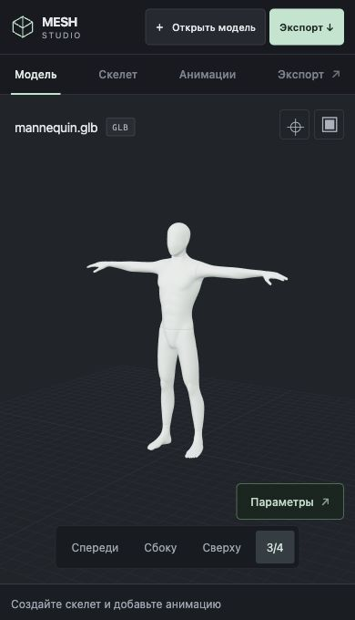
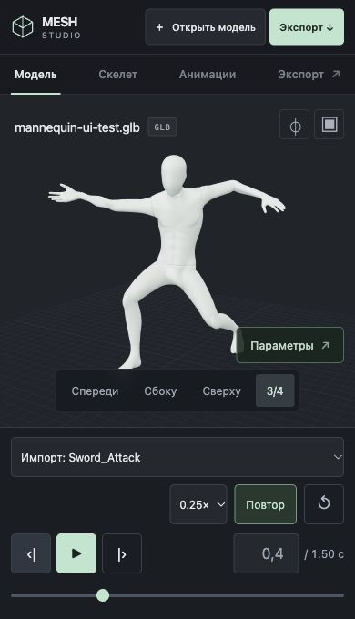
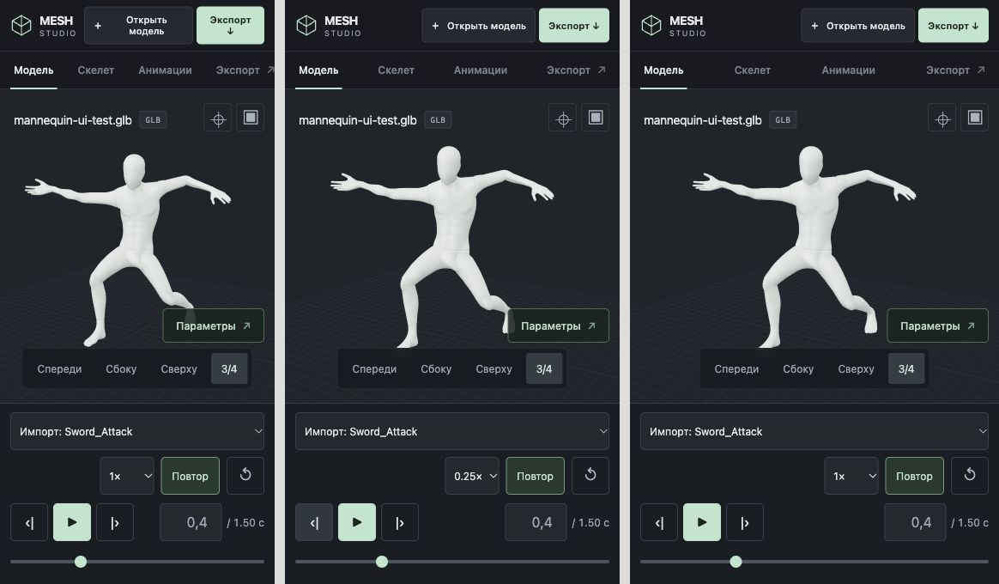
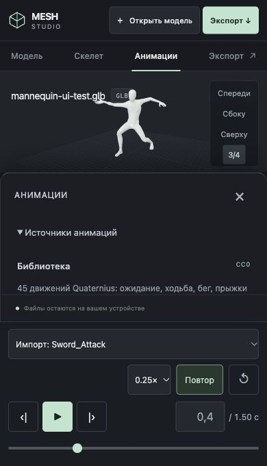

# Исправление мобильной панели анимации

Scope: дополнение к issue #85 и PR #86 по пользовательскому screenshot. Игровые и rigging-контракты не меняются.

- До загрузки клипа остаётся компактная подсказка; неактивные кнопки, нулевое время и шкала скрыты.
- На мобильном экране название клипа занимает отдельную строку. Настройки больше не сжимают название.
- Кнопки воспроизведения и точное время закреплены на одной строке; шкала находится под ними. Кнопки и поле времени имеют высоту 44 px, поле использует шрифт 16 px.
- Сохраняются safe-area inset и динамическая привязка inspector к высоте transport.

## Визуальная проверка

Внутренний Codex Browser / CUA: реальная responsive-страница в локальных iframe 320 × 680, 390 × 680, 430 × 680. Это проверка viewport, не эмуляция физических Android/iOS устройств. Временная QA-обёртка удалена перед публикацией.

Проверены пустое состояние, импорт GLB с клипами, выбор Sword_Attack, пауза на 0.4 с, следующий/предыдущий кадр, скорость 0.25×, открытие/закрытие нижнего inspector. На всех трёх ширинах horizontal overflow transport отсутствует, кнопки и timecode занимают одну строку. Desktop 1280 × 720: повторный импорт и точная пауза сохраняются, console errors отсутствуют. Известное инструментальное сообщение MutationObserver в iframe воспроизводилось на пустой контрольной странице в предыдущей итерации; оно не относится к runtime просмотрщика.

Добавлены два React regression tests: пустое состояние без бесполезных playback controls; доступные playback/seek/time controls после загрузки клипа. Проверены web typecheck, 73 Vitest tests + 43 Node Meshy tests, root lint/build и отдельная сборка Meshy.

Architectural impact: none. Project Status Check: Not required.
