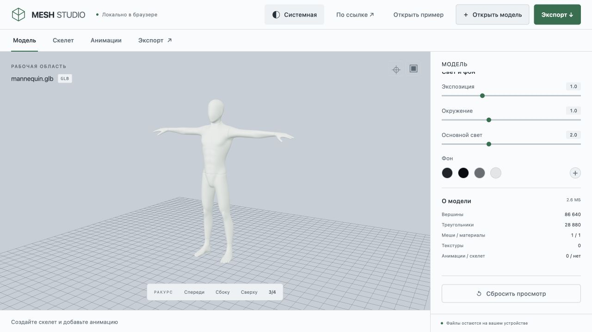
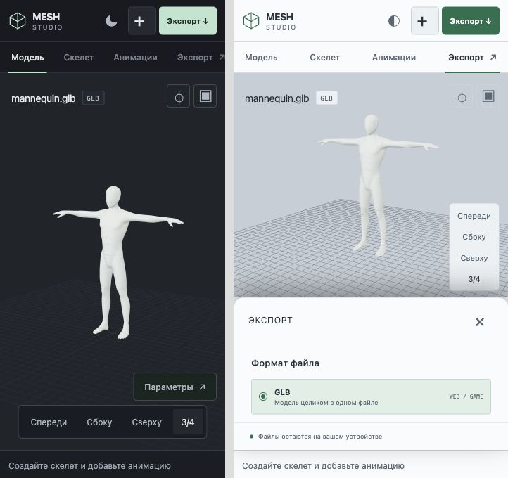
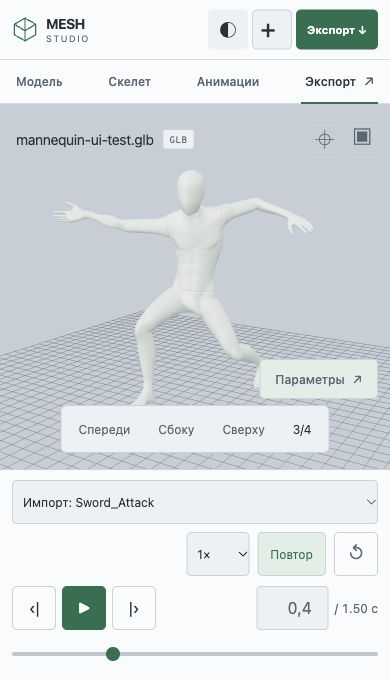
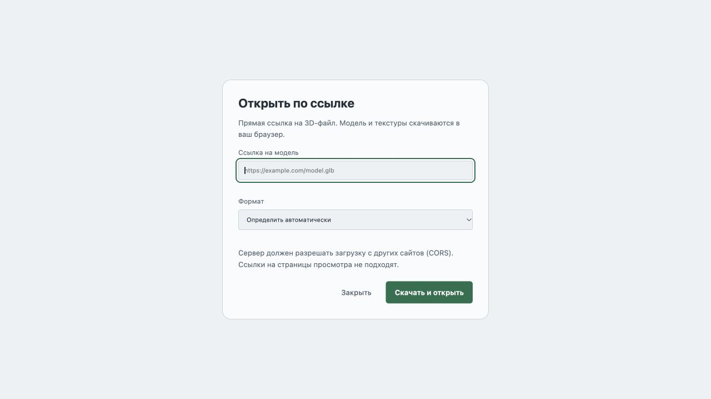

# Темы Mesh Studio

Расширение issue #85 / PR #86 по запросу пользователя. По умолчанию выбран режим «Системная»: оформление следует `prefers-color-scheme`, включая изменения во время работы. Кнопка в шапке циклически переключает «Системная → Светлая → Тёмная → Системная», показывает текущий режим и сохраняет выбор в `localStorage`. При недоступном storage переключение продолжает работать для текущего посещения. CSS учитывает системную тему до запуска приложения, сохранённая явная тема устанавливается в head.

Светлая палитра покрывает шапку, workflow, inspector, поля, transport, диалог загрузки, состояния выбора и сообщения. Фон сцены следует теме, пока пользователь не выберет свой; ручной фон сохраняется при переключении, сброс просмотра возвращает фон текущей темы. На мобильном экране кнопки темы и открытия модели компактные, доступные названия сохраняются. Игровые контракты и rigging не меняются.

## Визуальная проверка

Внутренний Codex Browser / CUA:

- Desktop 1280 × 720: системная светлая тема, ручной выбор светлой, перезагрузка с сохранением выбора, тёмная тема, возврат к системной, ручной чёрный фон и reset, диалог URL.
- Mobile: реальная responsive-страница в iframe 320 × 680 и 390 × 680, тёмная/светлая шапка, нижний export inspector, импорт GLB с клипами, Sword_Attack на 0.4 секунды, переключение темы без сброса клипа или позиции. Это viewport QA, не эмуляция физических устройств; временная QA-обёртка не публикуется.
- Desktop console errors отсутствуют. Известное инструментальное сообщение MutationObserver в iframe описано в предыдущей проверке и не относится к runtime просмотрщика.

Три regression tests проверяют следование системным изменениям, сохранение/цикл режимов и работу при заблокированном storage. Всего 46 Node Meshy tests и 73 web Vitest tests. Проверены web typecheck, root lint/build, build:meshy.

Architectural impact: none. Project Status Check: Not required.
