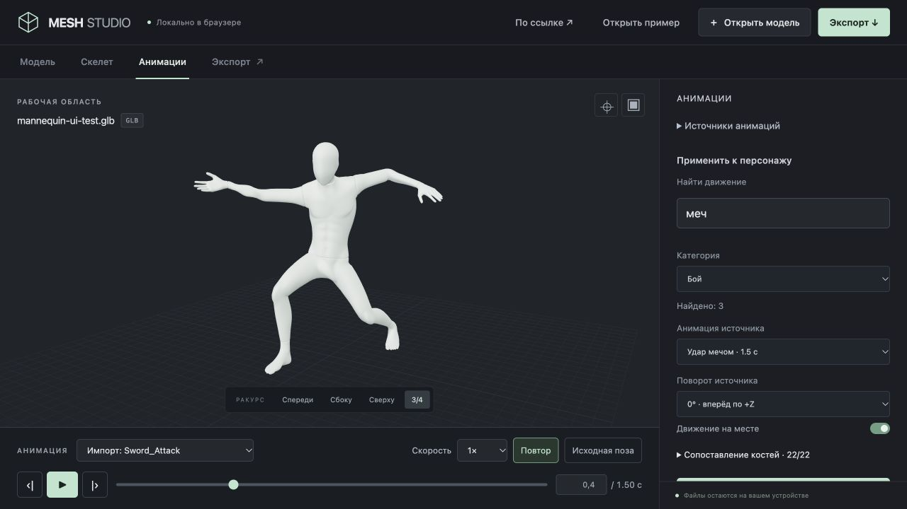
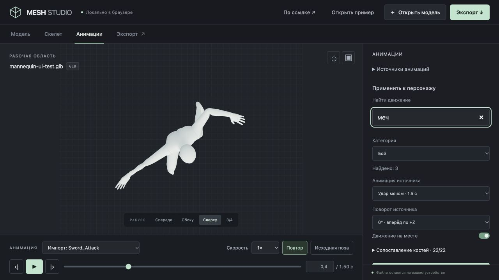
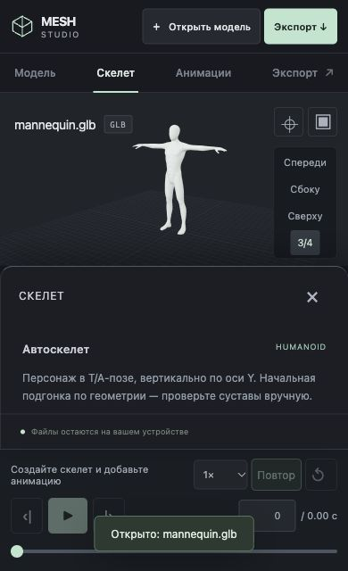
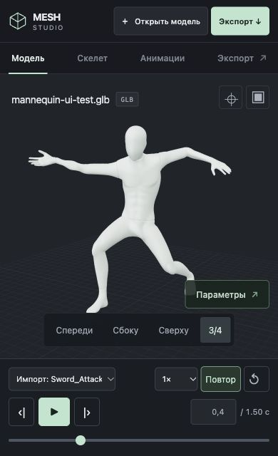

# Mesh Studio: первая UI/UX-итерация

Scope: пользовательское расширение issue #85 и PR #86. Игровые контракты не меняются.

## Что изменилось

- Рабочие разделы вынесены над сценой: модель, скелет, анимации, экспорт. Настройки справа относятся к выбранному разделу.
- Постоянный transport под моделью: выбор клипа, play/pause, позиция, точный ввод времени, шаг ±1/30 секунды, скорость, повтор, исходная поза.
- Пробел управляет воспроизведением, стрелки — кадрами, F вписывает модель. В полях ввода горячие клавиши не перехватываются. Стрелки/Home/End переключают вкладки с корректным фокусом.
- Поиск по русскому и исходному имени движения и фильтр категории. После загрузки настройки источника сворачиваются, выбор клипа выходит на первый план.
- Экспорт доступен из шапки. Подписи и основные настройки увеличены.
- На узком экране настройки открываются снизу, сцене отводится собственное место, transport остаётся доступным. Загрузка модели по ссылке доступна в разделе «Модель».
- Начат постепенный перенос UI на React + TypeScript: новый transport — типизированный React-компонент. Существующие панели и runtime сцены пока сохраняются. Vite уже использовался; добавлен существующий React plugin для этого entry point. Новых зависимостей и workspace packages нет.

## Визуальная проверка

Инструмент: внутренний Codex Browser / CUA.

Desktop 1280 × 720:
1. Манекен → создать скелет → привязать.
2. Загрузить Quaternius → поиск «меч», категория «Бой»: 3 результата → применить Sword_Attack.
3. Ввести 0.4 секунды: модель останавливается; следующий кадр 0.433, предыдущий 0.4. Скорость 0.25× сохраняется.
4. Экспорт GLB с тремя клипами → повторный импорт → выбрать Sword_Attack и остановить на 0.4.
5. Проверены вид сверху, 3/4, переключение панелей, отсутствие потери выбранного клипа и позиции.

Mobile 390 × 640:
- Реальная страница загружена в iframe указанного размера в локальной QA-обёртке. Это проверка responsive viewport в браузере, не эмуляция устройства.
- Повторный импорт GLB, выбор Sword_Attack и точная пауза на 0.4 секунды; загрузка по ссылке открывает диалог.
- Создание и привязка скелета, открытие/закрытие нижней панели; модель, ракурсы и transport видны одновременно.
- Обёртка не входит в исходники или публикацию Pages.

Новые regression tests проверяют точную paused-позу при разных скоростях, возврат с конца клипа, границы и шаг 1/30 секунды. Всего 43 теста Meshy.

Architectural impact: none для игры. Project Status Check: Not required — checkpoint/roadmap проекта не изменены.
